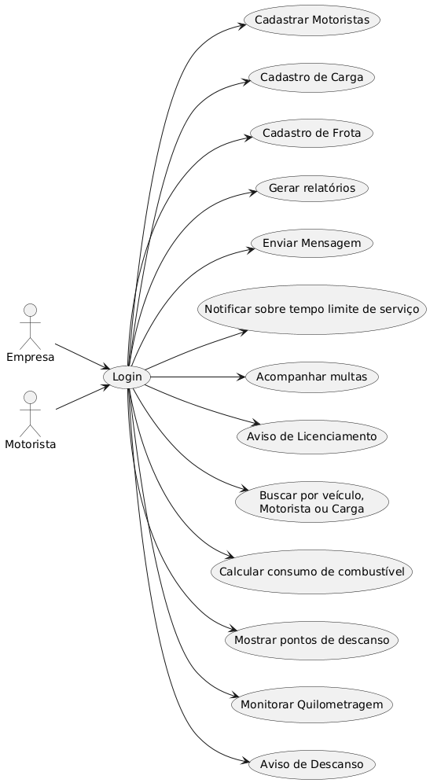

# Casos de Uso

## Login

**Atores Principais**: Empresa e Motoristas
**Descrição**: Permite à empresa e aos motoristas terem acesso às funcionalidades do sistema

**Pré-condições**:
- Sistema deve estar online e funcionando
- Usuário deve possuir conta cadastrada no sistema

**Fluxo Principal**:
1. O usuário vai acessar o sistema na página de login
2. O motorista irá colocar as credenciais fornecidas pela empresa
3. A empresa irá colocar a credencial de administrador fornecida pelos desenvolvedores do sistema
4. O sistema valida as credenciais fornecidas
5. O sistema redireciona o usuário para a interface correspondente ao seu perfil

**Fluxos Alternativos**:
- **FA1**: Primeiro acesso - Sistema solicita troca de senha temporária
- **FA2**: Credenciais inválidas - Sistema exibe mensagem de erro e mantém formulário

**Fluxos de Exceção**:
- **FE1**: Conta bloqueada - Sistema exibe mensagem de bloqueio e tempo de espera
- **FE2**: Falha de conexão - Sistema exibe erro de conexão e solicita nova tentativa
- **FE3**: Muitas tentativas - Sistema bloqueia temporariamente a conta

**Pós-condições**:
- Usuário autenticado no sistema
- Sessão criada e ativa
- Acesso às funcionalidades liberado conforme perfil

---

## Cadastro de Motorista

**Atores Principais**: Empresa (Administrador)
**Descrição**: Permite à empresa cadastrar novos motoristas no sistema

**Pré-condições**:
- Usuário deve estar logado como administrador
- Sistema deve estar funcionando normalmente
- Dados do motorista devem estar disponíveis

**Fluxo Principal**:
1. A empresa acessa o sistema
2. A empresa realiza o login com suas credenciais
3. Clica na opção de cadastro de motorista
4. O sistema exibe o formulário de cadastro
5. A empresa preenche o formulário com os dados do motorista
6. O sistema verifica se os dados são válidos e salva
7. O sistema vai retornar uma mensagem de cadastro realizado com o usuário e senha

**Fluxos Alternativos**:
- **FA1**: Dados inválidos - Sistema exibe mensagem de erro e mantém formulário
- **FA2**: Motorista já cadastrado - Sistema alerta sobre duplicação

**Fluxos de Exceção**:
- **FE1**: Falha de conexão - Sistema exibe erro e solicita nova tentativa
- **FE2**: Sistema indisponível - Usuário é redirecionado para página de erro
- **FE3**: Dados obrigatórios em branco - Sistema destaca campos obrigatórios

**Pós-condições**:
- Motorista cadastrado no sistema
- Credenciais de acesso geradas
- Confirmação enviada ao administrador

---

## Cadastro de Carga

**Atores Principais**: Empresa (Administrador)
**Descrição**: Permite à empresa cadastrar cargas para transporte

**Pré-condições**:
- Usuário deve estar logado como administrador
- Sistema deve estar funcionando normalmente
- Dados da carga devem estar disponíveis

**Fluxo Principal**:
1. A empresa acessa o sistema
2. A empresa realiza o login com suas credenciais
3. A empresa clica na opção de cadastro de cargas
4. O sistema exibe o formulário de cadastro
5. A empresa preenche o formulário com os dados da carga
6. O sistema verifica se os dados são válidos 
7. O sistema irá retornar uma mensagem de cadastro realizado 

**Fluxos Alternativos**:
- **FA1**: Dados inválidos - Sistema exibe mensagem de erro e mantém formulário
- **FA2**: Carga já cadastrada - Sistema alerta sobre duplicação

**Fluxos de Exceção**:
- **FE1**: Falha de conexão - Sistema exibe erro e solicita nova tentativa
- **FE2**: Sistema indisponível - Usuário é redirecionado para página de erro
- **FE3**: Dados obrigatórios em branco - Sistema destaca campos obrigatórios

**Pós-condições**:
- Carga cadastrada no sistema
- Status definido como "Aguardando"
- Confirmação enviada ao administrador

---

## Cadastro de Frota

**Atores Principais**: Empresa (Administrador)
**Descrição**: Permite à empresa cadastrar novas frotas de veículos

**Pré-condições**:
- Usuário deve estar logado como administrador
- Sistema deve estar funcionando normalmente
- Dados do veículo devem estar disponíveis

**Fluxo Principal**:
1. A empresa acessa o sistema
2. A empresa realiza o login com suas credenciais
3. A empresa clica na opção de cadastro de frotas
4. O sistema exibe o formulário de cadastro
5. A empresa preenche o formulário com os dados da frota
6. O sistema verifica se os dados são válidos 
7. O sistema irá retornar uma mensagem de cadastro realizado

**Fluxos Alternativos**:
- **FA1**: Dados inválidos - Sistema exibe mensagem de erro e mantém formulário
- **FA2**: Veículo já cadastrado - Sistema alerta sobre duplicação de placa

**Fluxos de Exceção**:
- **FE1**: Falha de conexão - Sistema exibe erro e solicita nova tentativa
- **FE2**: Sistema indisponível - Usuário é redirecionado para página de erro
- **FE3**: Dados obrigatórios em branco - Sistema destaca campos obrigatórios

**Pós-condições**:
- Veículo cadastrado na frota
- Status definido como "Disponível"
- Confirmação enviada ao administrador

---

## Gerar Relatórios

**Atores Principais**: Empresa e Motorista
**Descrição**: Gera um relatório completo contendo motorista, veículo, carga, horário de saída e chegada, destino e rota

**Pré-condições**:
- Usuário deve estar logado no sistema
- Dados para relatório devem estar disponíveis
- Sistema deve estar funcionando normalmente

**Fluxo Principal**:
1. O usuário acessa o sistema
2. O usuário realiza o login com suas credenciais
3. O usuário seleciona a opção de relatório
4. O usuário escolhe a opção de gerar relatório
5. O sistema ira retornar um relatorio completo

**Fluxos Alternativos**:
- **FA1**: Relatório por período - Usuário define período específico
- **FA2**: Relatório por motorista - Usuário filtra por motorista específico
- **FA3**: Relatório por veículo - Usuário filtra por veículo específico

**Fluxos de Exceção**:
- **FE1**: Sem dados disponíveis - Sistema exibe mensagem de "sem dados"
- **FE2**: Falha na geração - Sistema exibe erro e solicita nova tentativa
- **FE3**: Período inválido - Sistema alerta sobre período incorreto

**Pós-condições**:
- Relatório gerado e exibido
- Opção de download disponível
- Log de geração registrado

---

## Busca

**Atores Principais**: Empresa
**Descrição**: Permite à empresa realizar uma busca por veículo, motorista ou carga

**Pré-condições**:
- Usuário deve estar logado como administrador
- Sistema deve estar funcionando normalmente
- Dados de busca devem estar disponíveis

**Fluxo Principal**:
1. A empresa acessa o sistema
2. A empresa realiza o login com suas credenciais
3. Seleciona a opção de busca
4. Filtra qual item quer buscar
5. O sistema retorna a busca baseada no filtro

**Fluxos Alternativos**:
- **FA1**: Busca por veículo - Retorna lista com veículos disponíveis e ocupados
- **FA2**: Busca por motorista - Retorna dados do motorista e viagens ativas
- **FA3**: Busca por carga - Retorna status e localização da carga

**Fluxos de Exceção**:
- **FE1**: Nenhum resultado encontrado - Sistema exibe mensagem de "sem resultados"
- **FE2**: Falha na busca - Sistema exibe erro e solicita nova tentativa
- **FE3**: Filtros inválidos - Sistema alerta sobre filtros incorretos

**Pós-condições**:
- Resultados da busca exibidos
- Filtros aplicados mantidos
- Histórico de busca atualizado

---

## Envio de Mensagens

**Atores Principais**: Empresa e Motoristas
**Descrição**: Permite a comunicação escrita entre empresa e motorista

**Pré-condições**:
- Usuário deve estar logado no sistema
- Destinatário deve estar cadastrado
- Sistema deve estar funcionando normalmente

**Fluxo Principal**: 
1. O usuário vai acessar o sistema
2. O usuário vai logar no sistema
3. O usuário vai selecionar a opção de mensagens
4. O usuário seleciona para quem deseja enviar a mensagem ou ver as recebidas

**Fluxos Alternativos**:
- **FA1**: Envio de mensagem - Usuário escreve e envia nova mensagem
- **FA2**: Visualização de mensagens - Usuário visualiza mensagens recebidas
- **FA3**: Resposta a mensagem - Usuário responde mensagem existente

**Fluxos de Exceção**:
- **FE1**: Destinatário não encontrado - Sistema exibe erro de destinatário inválido
- **FE2**: Mensagem muito longa - Sistema limita tamanho da mensagem
- **FE3**: Falha no envio - Sistema exibe erro e solicita nova tentativa

**Pós-condições**:
- Mensagem enviada e registrada
- Notificação enviada ao destinatário
- Histórico de mensagens atualizado

---

## Multas

**Atores Principais**: Empresa
**Descrição**: Permite à empresa ver as multas dos veículos

**Pré-condições**:
- Usuário deve estar logado como administrador
- Sistema deve estar funcionando normalmente
- Dados de multas devem estar disponíveis

**Fluxo Principal**:
1. A empresa vai acessar o sistema
2. A empresa realiza o login com suas credenciais
3. A empresa seleciona a opção de multas
4. O sistema irá retornar todos os veículos que estão com multa
5. A empresa irá direcionar a multa para o motorista responsável

**Fluxos Alternativos**:
- **FA1**: Multa por veículo - Filtra multas por veículo específico
- **FA2**: Multa por motorista - Filtra multas por motorista específico
- **FA3**: Multa por período - Filtra multas por período específico

**Fluxos de Exceção**:
- **FE1**: Sem multas registradas - Sistema exibe mensagem de "sem multas"
- **FE2**: Falha na consulta - Sistema exibe erro e solicita nova tentativa
- **FE3**: Motorista não encontrado - Sistema alerta sobre motorista inválido

**Pós-condições**:
- Lista de multas exibida
- Multas direcionadas aos motoristas responsáveis
- Histórico de direcionamentos atualizado

---

## Licenciamento

**Atores Principais**: Empresa
**Descrição**: A empresa acompanha os licenciamentos dos veículos

**Pré-condições**:
- Usuário deve estar logado como administrador
- Sistema deve estar funcionando normalmente
- Dados de licenciamento devem estar disponíveis

**Fluxo Principal**: 
1. A empresa acessa o sistema
2. A empresa realiza o login com suas credenciais
3. A empresa seleciona a opção de licenciamento
4. O sistema irá retornar o licenciamento de todos os veículos e as datas de pagamento
5. O sistema irá notificar quando estiver próximo à data de pagamento do licenciamento

**Fluxos Alternativos**:
- **FA1**: Licenciamento por veículo - Filtra por veículo específico
- **FA2**: Licenciamento por período - Filtra por período de vencimento
- **FA3**: Histórico de pagamentos - Visualiza histórico de pagamentos

**Fluxos de Exceção**:
- **FE1**: Sem veículos cadastrados - Sistema informa que não há veículos para exibir
- **FE2**: Falha na consulta - Sistema exibe erro e solicita nova tentativa
- **FE3**: Dados desatualizados - Sistema alerta sobre necessidade de atualização

**Pós-condições**:
- Lista de licenciamentos exibida
- Alertas de vencimento configurados
- Histórico de consultas atualizado

---

## Limite de Tempo

**Atores Principais**: Motorista
**Descrição**: Notifica o motorista sobre o tempo limite de serviço de descanso para a pausa de 30 min e o descanso de 24H

**Pré-condições**:
- Motorista deve estar logado no sistema
- Viagem deve estar em andamento
- Sistema deve estar funcionando normalmente

**Fluxo Principal**:
1. O motorista irá acessar o sistema
2. O motorista irá realizar o login com suas credenciais
3. O sistema irá notificar o motorista caso ele atinja os limites determinados pela empresa

**Fluxos Alternativos**:
- **FA1**: Pausa de 30 min - Sistema alerta sobre necessidade de pausa
- **FA2**: Descanso de 24H - Sistema alerta sobre necessidade de descanso
- **FA3**: Histórico de tempo - Motorista visualiza histórico de tempo trabalhado

**Fluxos de Exceção**:
- **FE1**: GPS desativado - Sistema solicita ativação do GPS
- **FE2**: Falha na contagem - Sistema exibe erro e solicita verificação
- **FE3**: Dados inconsistentes - Sistema alerta sobre inconsistência

**Pós-condições**:
- Alertas de tempo exibidos
- Histórico de tempo atualizado
- Recomendações de descanso fornecidas

---

## Pontos de Descanso

**Atores Principais**: Motorista
**Descrição**: Notifica o motorista quando existirem pontos de descanso próximos

**Pré-condições**:
- Motorista deve estar logado no sistema
- Viagem deve estar em andamento
- GPS deve estar ativo
- Sistema deve estar funcionando normalmente

**Fluxo Principal**:
1. O motorista irá acessar o sistema
2. O motorista irá realizar o login com suas credenciais 
3. O sistema irá notificar quando tiver algum ponto de descanso por perto

**Fluxos Alternativos**:
- **FA1**: Pontos próximos - Sistema lista pontos de descanso próximos
- **FA2**: Rota para ponto - Sistema calcula rota para ponto de descanso
- **FA3**: Informações do ponto - Sistema exibe detalhes do ponto de descanso

**Fluxos de Exceção**:
- **FE1**: GPS desativado - Sistema solicita ativação do GPS
- **FE2**: Sem pontos próximos - Sistema informa que não há pontos próximos
- **FE3**: Falha na localização - Sistema exibe erro de localização

**Pós-condições**:
- Pontos de descanso identificados
- Rotas calculadas
- Informações de pontos exibidas

---

## Monitorar Km

**Atores Principais**: Motorista
**Descrição**: Permite ao motorista ver quantos quilômetros foram percorridos do ponto de origem até o destino, quanto falta para chegar e monitorar a velocidade atual

**Pré-condições**:
- Motorista deve estar logado no sistema
- Viagem deve estar em andamento
- GPS deve estar ativo
- Sistema deve estar funcionando normalmente

**Fluxo Principal**:
1. O motorista irá acessar o sistema
2. O motorista irá realizar o login com suas credenciais 
3. O motorista irá para a tela de viagem
4. O sistema irá mostrar a quilometragem total, quanto foi percorrido, quanto está faltando e a velocidade atual do veículo
5. O sistema irá alertar caso a velocidade ultrapasse o limite permitido

**Fluxos Alternativos**:
- **FA1**: Histórico de viagem - Motorista visualiza histórico de viagens
- **FA2**: Estatísticas de velocidade - Sistema exibe estatísticas de velocidade
- **FA3**: Alertas de velocidade - Sistema configura alertas personalizados

**Fluxos de Exceção**:
- **FE1**: GPS desativado - Sistema solicita ativação do GPS
- **FE2**: Sem viagem em andamento - Sistema exibe mensagem de "sem viagem ativa"
- **FE3**: Falha na contagem - Sistema exibe erro e solicita verificação

**Pós-condições**:
- Quilometragem atualizada em tempo real
- Alertas de velocidade configurados
- Histórico de viagem atualizado

---

## Média de Combustível

**Atores Principais**: Empresa
**Descrição**: Permite à empresa ter uma média de Km/L que o veículo irá fazer para estimar o quanto vai ser gasto de combustível, além de manter um histórico de consumo

**Pré-condições**:
- Usuário deve estar logado como administrador
- Sistema deve estar funcionando normalmente
- Dados de consumo devem estar disponíveis

**Fluxo Principal**:
1. A empresa acessa o sistema
2. A empresa realiza o login com suas credenciais
3. A empresa irá apertar o botão de cálculo de média
4. O sistema irá pedir as informações de origem, destino e modelo do veículo
5. A empresa preenche todas as informações
6. O sistema calcula e informa uma média de consumo baseada nas informações fornecidas
7. O sistema exibe um histórico comparativo de consumo do veículo

**Fluxos Alternativos**:
- **FA1**: Média por veículo - Calcula média específica por veículo
- **FA2**: Média por rota - Calcula média para rota específica
- **FA3**: Média por período - Calcula média para período específico

**Fluxos de Exceção**:
- **FE1**: Dados insuficientes - Sistema exibe mensagem de "dados insuficientes"
- **FE2**: Falha no cálculo - Sistema exibe erro e solicita nova tentativa
- **FE3**: Informações inválidas - Sistema alerta sobre informações incorretas

**Pós-condições**:
- Média de consumo calculada
- Histórico comparativo exibido
- Relatório de consumo gerado
