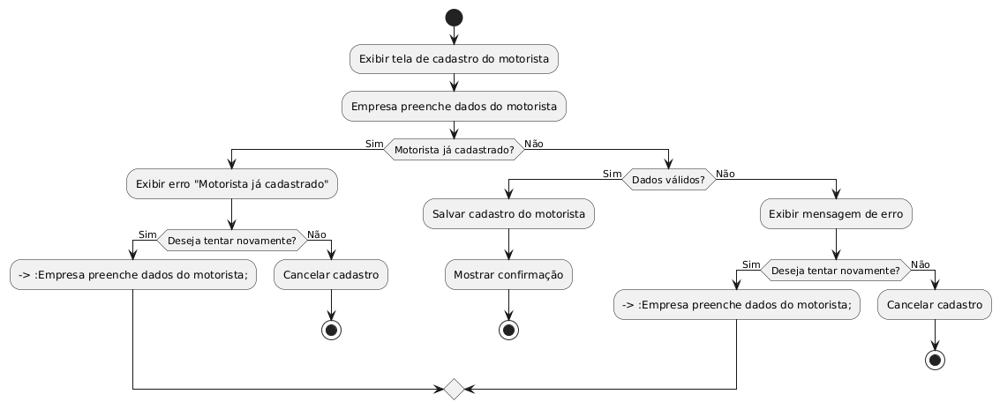
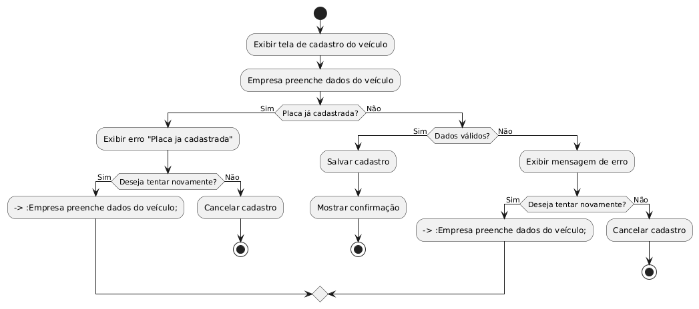
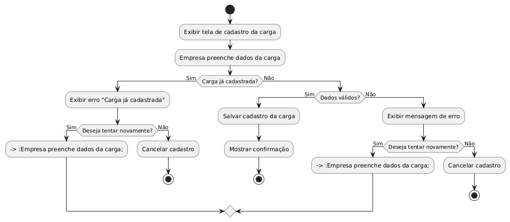
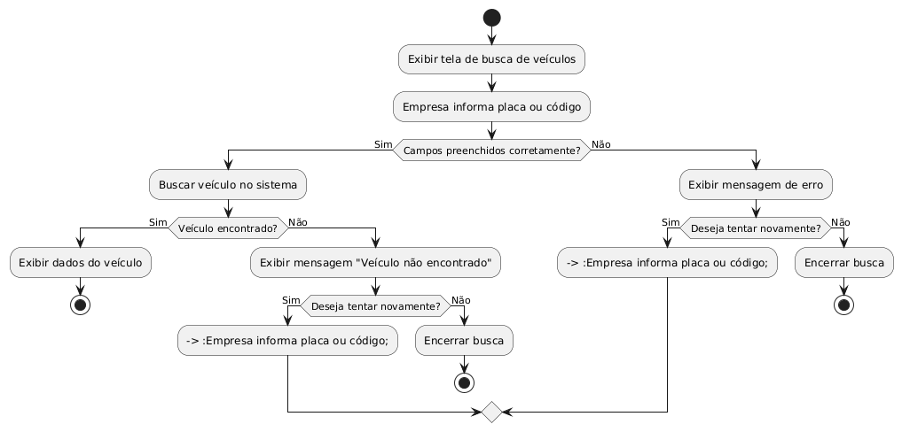
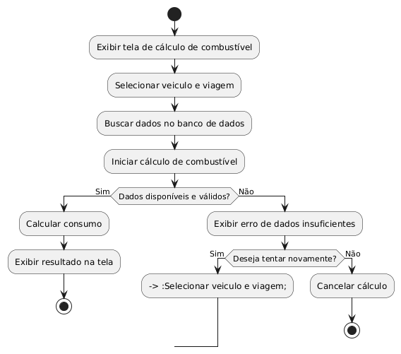
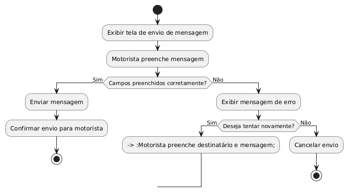
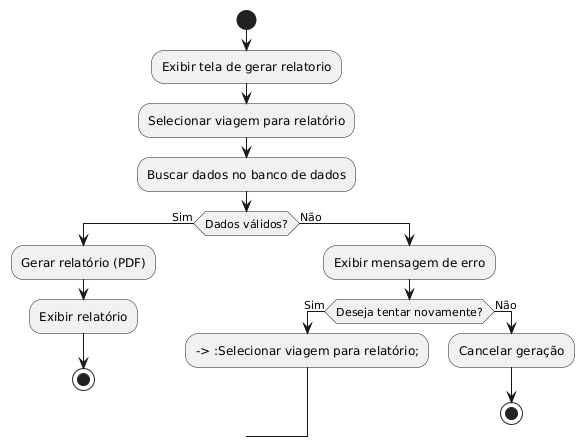
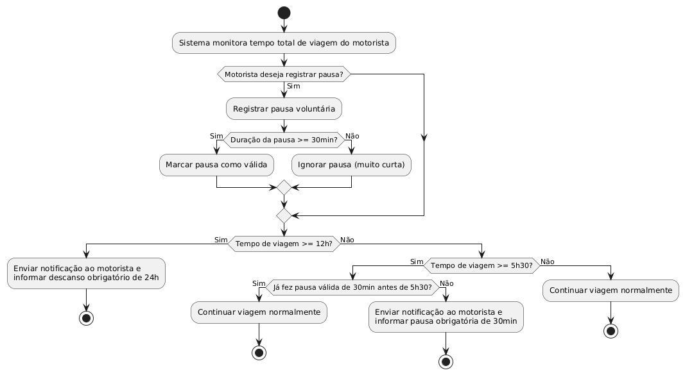
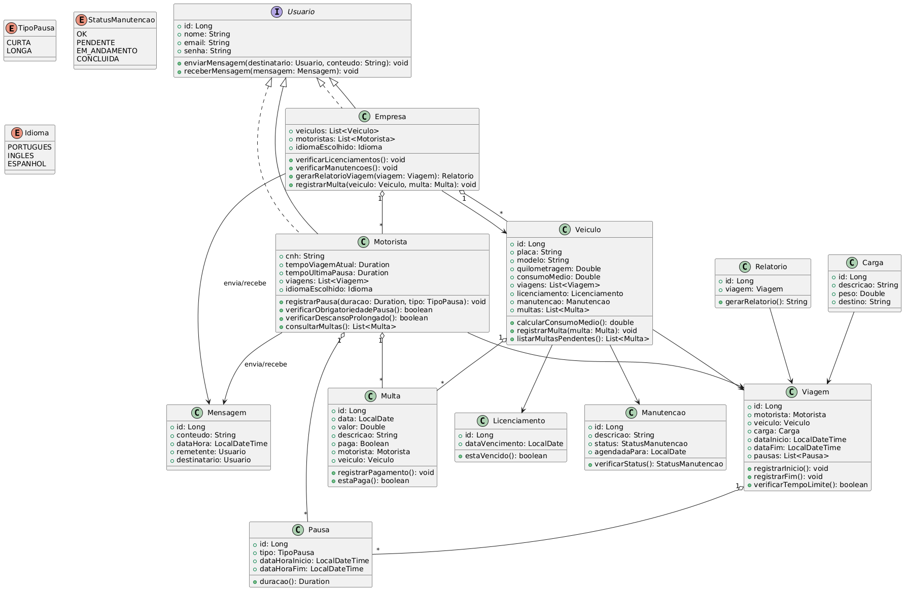

# 📊 Diagramas UML do Sistema

## 🔹 Diagramas de Atividade

### Atividade - Cadastrar motorista
Nesse diagrama ilustra-se a atividade de cadastrar motorista, na qual o gestor da empresa pode acessar o sistema e cadastrar um
novo motorista, adicionando os seus dados.

### Atividade - Cadastrar frota
Nesse diagrama ilustra-se a atividade de cadastrar a frota da empresa, na qual o gestor da empresa pode acessar o sistema e
adicionar os dados para cadastro de um novo veículo.

### Atividade - Cadastrar carga
Nesse diagrama ilustra-se a atividade de cadastrar uma carga, na qual o gestor da empresa pode acessar o sistema e
adicionar os dados para cadastro de uma nova carga.

### Atividade - Alerta de licenciamento próximo ao vencimento
Nesse diagrama ilustra-se a atividade de gerar o alerta de licenciamento próximo ao vencimento, na qual o sistema, por meio de 
verificações constantes, ao verificar a proximidade do vencimento do licenciamento de um veículo da frota, emite uma mensagem
de alerta ao gestor da empresa.

### Atividade - Buscar veículo
Nesse diagrama ilustra-se a atividade de buscar/filtrar veículos da frota da empresa, na qual o gestor da empresa pode acessar
o sistema, adicionar os dados do veículo requerido na busca e ter acesso ao status desse veículo.

### Atividade - Calcular média de consumo de combustível
Nesse diagrama ilustra-se a atividade de calcular a média de consumo de combustível de cada veiculo da frota,
na qual o sistema, a partir de dados de abastecimento e distância percorrida pelo veículo, calcula a sua média
de consumo e disponibiliza essa informação ao gestor da empresa.

### Atividade - Empresa envia mensagem ao motorista
Nesse diagrama ilustra-se a atividade de envio de mensagem ao motorista, na qual o gestor da empresa pode acessar o sistema, no
campo correspondente, selecionar um motorista e enviar uma mensagem de texto a esse motorista.

### Atividade - Motorista envia mensagem para a empresa
Nesse diagrama ilustra-se a atividade de envio de mensagem para a empresa, na qual o motorista pode acessar o sistema, no campo
correspondente, escrever e enviar uma mensagem de texto para o gestor da empresa.

### Atividade - Motorista seleciona Pontos de Descanso
Nesse diagrama ilustra-se a atividade de seleção de pontos de descanso ao motorista. O sistema localiza a posição atual do motorista e lista os pontos de descanso mais próximos. Após isso, o motorista seleciona o ponto e o sistema verifica a sua disponibilidade. Caso esteja indisponivel, é exibida a mensagem de indisponibilidade.

### Atividade - Gerar relatório de viagem
Nesse diagrama ilustra-se a atividade de geração de relatório de viagem. O gestor da empresa acessa o sistema, seleciona a viagem desejada e o sistema coleta os dados correspondentes. Caso os dados sejam válidos, o sistema gera um relatório detalhado e o disponibiliza. Se os dados forem inválidos, uma mensagem de erro é exibida, solicitando nova seleção da viagem.

### Atividade -  Gerenciar Pausas do Motorista
Nesse diagrama ilustra-se a atividade de monitoramento do tempo de viagem do motorista. A viagem se inicia e o sistema verifica continuamente se o motorista atingiu 5h30min de viagem. Caso isso ocorra, o motorista é notificado. Se ele já tiver feito uma pausa de 30 minutos, poderá continuar a viagem. Caso contrário, o sistema informa um ponto de descanso e contabiliza a pausa. Ao atingir 12h de viagem, o motorista deve descansar por 24h antes de continuar.

### Atividade - Login do motorista
Nesse diagrama ilustra-se a atividade de login do motorista. O sistema exibe a tela de login e o motorista informa email e senha. Se os campos estiverem preenchidos, o sistema valida as credenciais. Se forem inválidas, uma mensagem de erro é exibida. Se forem válidas e for o primeiro acesso, o sistema solicita a troca de senha. Após isso, ou em acessos futuros, o motorista é redirecionado ao painel. Caso os campos não estejam preenchidos, o sistema solicita o preenchimento e retorna para a tela de login.

## 🔹 Diagramas de Estados
### Estados - Motorista
Nesse diagrama ilustra-se os estados que um motorista pode apresentar.

### Estados - Veículo
Nesse diagrama ilustra-se os estados que um veículo pode apresentar.

### Estados - Viagem
Nesse diagrama ilustra-se os estados que uma viagem pode apresentar.

### Estados - Carga
Nesse diagrama ilustra-se os estados que uma carga pode apresentar.

### Estados - Manutenção
Nesse diagrama ilustra-se os estados que a manutenção de um veiculo pode apresentar.

### Estados - Mensagem
Nesse diagrama ilustra-se os estados que uma mensagem pode apresentar.

## 🔹 Diagrama de Classe
### Classe
Neste diagrama ilustra-se várias das classes, com seus respectivos métodos, que compõem esse Sistema.

### 🔹 Diagrama de Componentes
Neste diagrama estão expostos os componentes essenciais para o funcionamento do syslog e suas relações dentro do sistema.

