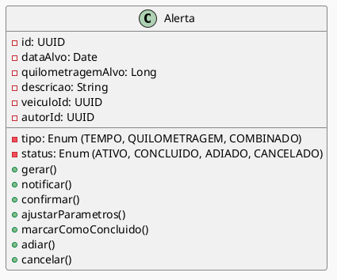

# Diagrama de Classes: Alerta
- Alertas por tempo e quilometragem;
- Notificações para todos os motoristas;
- Sugestões de alertas baseadas no histórico;
- Cálculo dinâmico de alertas.

```puml

@startuml
!theme mars

class Alerta {
    -id: UUID
    -tipo: Enum (TEMPO, QUILOMETRAGEM, COMBINADO)
    -dataAlvo: Date
    -quilometragemAlvo: Long
    -descricao: String
    -status: Enum (ATIVO, CONCLUIDO, ADIADO, CANCELADO)
    -veiculoId: UUID
    -autorId: UUID
    +gerar()
    +notificar()
    +confirmar()
    +ajustarParametros()
    +marcarComoConcluido()
    +adiar()
    +cancelar()
}

@enduml
```
