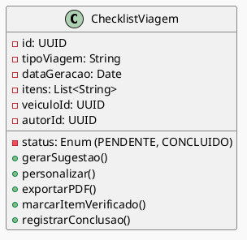

# Checklist de Viagem
- Lista sugerida baseada em tipo de viagem e revisão;
- Exportação em PDF.

```puml
@startuml
!theme mars

class ChecklistViagem {
    -id: UUID
    -tipoViagem: String
    -dataGeracao: Date
    -itens: List<String>
    -status: Enum (PENDENTE, CONCLUIDO)
    -veiculoId: UUID
    -autorId: UUID
    +gerarSugestao()
    +personalizar()
    +exportarPDF()
    +marcarItemVerificado()
    +registrarConclusao()
}

@enduml
```
