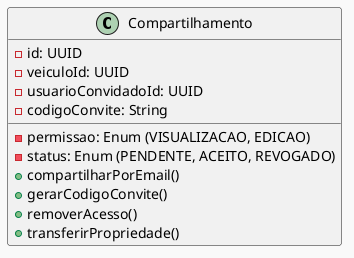

# Diagrama de Classes: Compartilhamento de Veículo  
- Compartilhamento por e-mail ou código de convite;  
- Controle de permissões (visualização ou edição);  
- Remoção de acesso a qualquer momento;  
- Notificações de alterações feitas por convidados;  
- Transferência de propriedade.

