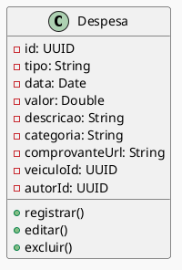

# Diagrama de Classes: Despesa
- Registro de despesas com abastecimento, manutenção, pedágios e mais;  
- Classificação por categoria para controle financeiro;  
- Inclusão de comprovantes em imagem ou PDF;  
- Edição ou exclusão de lançamentos a qualquer momento;  
- Associação de cada despesa a um veículo específico.

