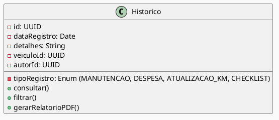

# Diagrama de Classes: Histórico  
- Registro completo de eventos vinculados a cada veículo;  
- Tipos de registro: manutenção, despesa, atualização de quilometragem e checklist;  
- Consulta detalhada dos acontecimentos por data;  
- Filtros por tipo e autor do registro.

