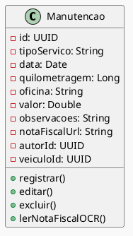

# Diagrama de Classes: Manutenção  
- Registro detalhado do tipo de serviço, data e quilometragem;  
- Informações da oficina, valor gasto e observações complementares;  
- Upload de nota fiscal com leitura automática via OCR;  
- Edição e exclusão dos registros com rastreamento do autor.

