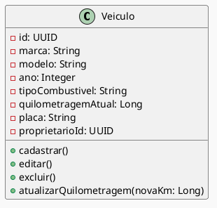

# Diagrama de Classes: Veículo  
- Cadastro de múltiplos veículos por usuário;  
- Campos obrigatórios: marca, modelo, ano, tipo de combustível, quilometragem atual, placa;  
- Validação de placa nos formatos Mercosul e antigo;  
- Prevenção de duplicidade de placa;  
- Indicação de proprietário e motoristas autorizados;  
- Edição e exclusão de veículos com controle de permissões.

