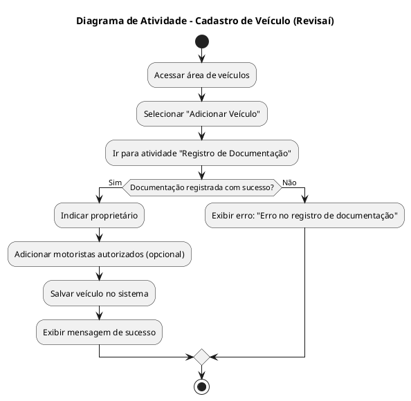

# Cadastro de Veículo

```puml
@startuml
title Diagrama de Atividade - Cadastro de Veículo (Revisaí)
start
:Acessar área de veículos;
:Selecionar "Adicionar Veículo";
:Ir para atividade "Registro de Documentação";
if (Documentação registrada com sucesso?) then (Sim)
:Indicar proprietário;
:Adicionar motoristas autorizados (opcional);
:Salvar veículo no sistema;
:Exibir mensagem de sucesso;
else (Não)
:Exibir erro: "Erro no registro de documentação";
endif
stop
@enduml
```
