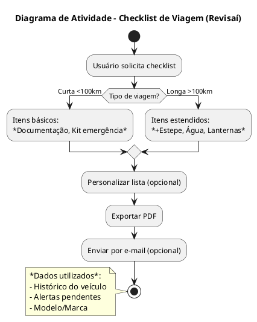

# Checklist de Viagem

```puml
@startuml
start
title Diagrama de Atividade - Checklist de Viagem (Revisaí)

:Usuário solicita checklist;

if (Tipo de viagem?) then (Curta <100km)
  :Itens básicos:
  *Documentação, Kit emergência*;
else (Longa >100km)
  :Itens estendidos:
  *+Estepe, Água, Lanternas*;
endif

:Personalizar lista (opcional);
:Exportar PDF;
:Enviar por e-mail (opcional);

stop

note left
  *Dados utilizados*:
  - Histórico do veículo
  - Alertas pendentes
  - Modelo/Marca
end note
@enduml
```
