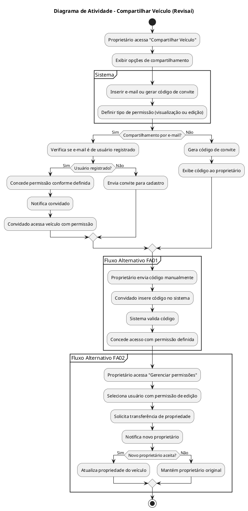

# Compartilhar Veículo

```puml
@startuml
start
title Diagrama de Atividade - Compartilhar Veículo (Revisaí)

:Proprietário acessa "Compartilhar Veículo";

:Exibir opções de compartilhamento;
partition "Sistema" {
  :Inserir e-mail ou gerar código de convite;
  :Definir tipo de permissão (visualização ou edição);
}

if (Compartilhamento por e-mail?) then (Sim)
  :Verifica se e-mail é de usuário registrado;
  if (Usuário registrado?) then (Sim)
    :Concede permissão conforme definida;
    :Notifica convidado;
    :Convidado acessa veículo com permissão;
  else (Não)
    :Envia convite para cadastro;
  endif
else (Não)
  :Gera código de convite;
  :Exibe código ao proprietário;
endif

partition "Fluxo Alternativo FA01" {
  :Proprietário envia código manualmente;
  :Convidado insere código no sistema;
  :Sistema valida código;
  :Concede acesso com permissão definida;
}

partition "Fluxo Alternativo FA02" {
  :Proprietário acessa "Gerenciar permissões";
  :Seleciona usuário com permissão de edição;
  :Solicita transferência de propriedade;
  :Notifica novo proprietário;

  if (Novo proprietário aceita?) then (Sim)
    :Atualiza propriedade do veículo;
  else (Não)
    :Mantém proprietário original;
  endif
}

stop
@enduml
```
