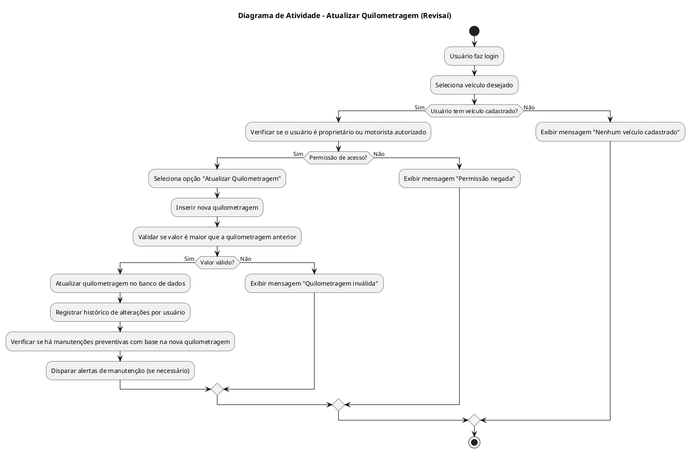

# Atualizar Quilometragem

```puml
@startuml
start
title Diagrama de Atividade - Atualizar Quilometragem (Revisaí)

:Usuário faz login;
:Seleciona veículo desejado;

if (Usuário tem veículo cadastrado?) then (Sim)
  :Verificar se o usuário é proprietário ou motorista autorizado;

  if (Permissão de acesso?) then (Sim)
    :Seleciona opção "Atualizar Quilometragem";
    :Inserir nova quilometragem;
    :Validar se valor é maior que a quilometragem anterior;

    if (Valor válido?) then (Sim)
      :Atualizar quilometragem no banco de dados;
      :Registrar histórico de alterações por usuário;
      :Verificar se há manutenções preventivas com base na nova quilometragem;
      :Disparar alertas de manutenção (se necessário);
    else (Não)
      :Exibir mensagem "Quilometragem inválida";
    endif

  else (Não)
    :Exibir mensagem "Permissão negada";
  endif

else (Não)
  :Exibir mensagem "Nenhum veículo cadastrado";
endif

stop
@enduml
```
