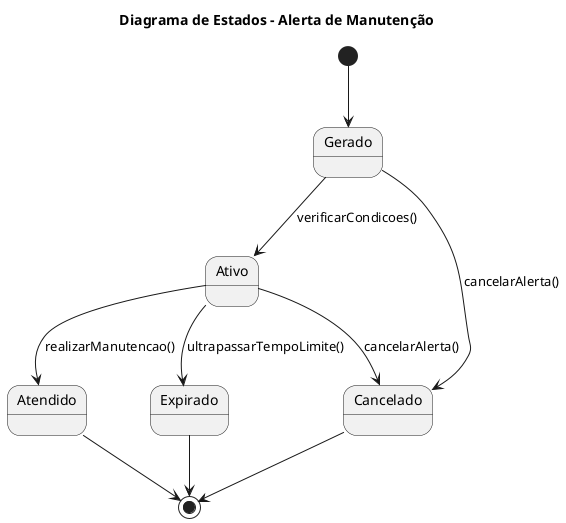

## Diagrama de Estado - Alerta de Manutenção
Descreve o comportamento dos alertas inteligentes do sistema, desde a geração até o encerramento.

Estados:

Gerado: Alerta criado com base em tempo ou quilometragem.

Ativo: Alerta próximo da condição de execução.

Atendido: Alerta resolvido após realização da manutenção.

Expirado: Alerta ignorado por tempo excessivo.

Cancelado: Alerta removido manualmente.

