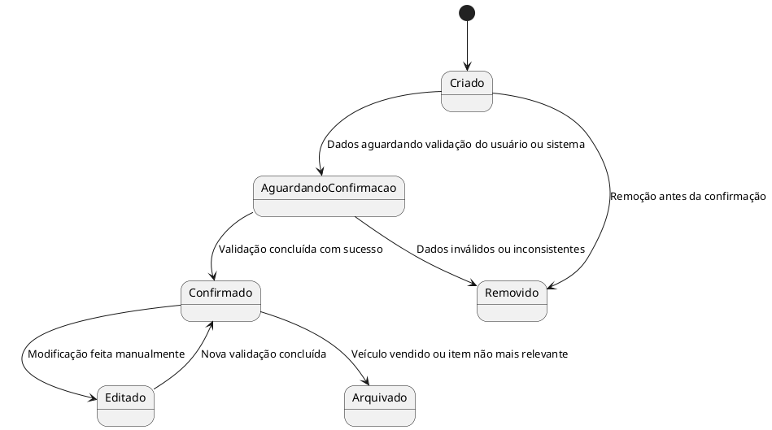

## Diagrama de Estado — Histórico de Manutenção
Estados:

Criado: Registro inicial criado automaticamente ou por usuário.

AguardandoConfirmação: Pendência de validação.

Confirmado: Registro validado.

Editado: Sofreu alguma edição.

Arquivado: Não mais ativo, mas fechado como histórico.

Removido: Apagado do sistema.

