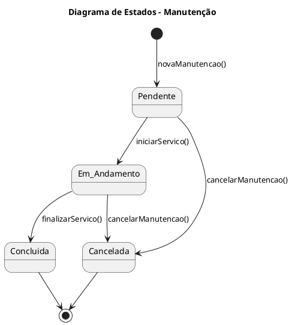

#### 🛠 Manutenção de Veículo

```plantuml
@startuml
title Diagrama de Estados - Manutenção

[*] --> Pendente : novaManutencao()

Pendente --> Em_Andamento : iniciarServico()
Pendente --> Cancelada : cancelarManutencao()

Em_Andamento --> Concluida : finalizarServico()
Em_Andamento --> Cancelada : cancelarManutencao()

Concluida --> [*]
Cancelada --> [*]
@enduml
```
