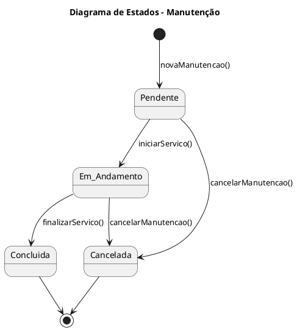

#### 🛠 Manutenção de Veículo
Reflete o ciclo de vida de uma manutenção veicular, desde o agendamento até sua conclusão ou cancelamento.

Estados:

Pendente: Manutenção registrada, mas ainda não iniciada.

Em Andamento: Manutenção atualmente sendo realizada.

Concluída: Serviço finalizado com sucesso.

Cancelada: Manutenção cancelada antes ou durante a execução.

