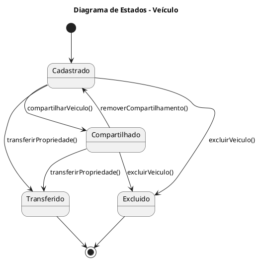

## Diagrama de Estado - Veículo
Mostra os estados de um veículo no sistema, desde o cadastro até o compartilhamento, transferência ou exclusão.

Estados:

Cadastrado: Veículo registrado no sistema por um usuário.

Compartilhado: Veículo acessível por outros usuários autorizados.

Transferido: Propriedade do veículo alterada para outro usuário.

Excluído: Veículo removido do sistema.

