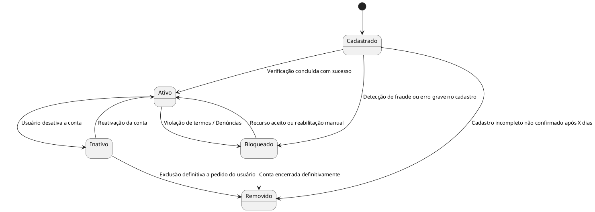

## Diagrama de Estado — Usuário
Estados:

Cadastrado: Usuário concluiu o processo de cadastro, mas ainda não está ativo.

Ativo: Usuário autenticado e utilizando o sistema normalmente.

Inativo: Conta desativada temporariamente.

Bloqueado: Conta impedida de acesso por razões administrativas.

Removido: Conta encerrada permanentemente.

