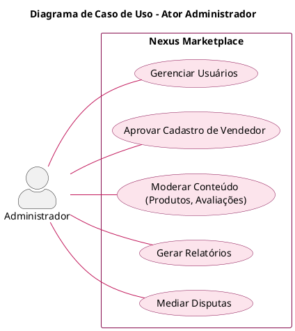

# Diagrama do Ator: Administrador

```plantuml

@startuml
' Configurações de aparência
skinparam actorStyle awesome
skinparam usecase {
    BackgroundColor #FCE4EC
    BorderColor #880E4F
    ArrowColor #C2185B
}
skinparam rectangle {
    BorderColor #880E4F
}
left to right direction

title Diagrama de Caso de Uso - Ator Administrador

' Ator
actor "Administrador" as A

' Sistema
rectangle "Nexus Marketplace" {
    usecase "Gerenciar Usuários" as UC14
    usecase "Aprovar Cadastro de Vendedor" as UC15
    usecase "Moderar Conteúdo \n(Produtos, Avaliações)" as UC16
    usecase "Gerar Relatórios" as UC17
    usecase "Mediar Disputas" as UC18
}

' Relacionamentos
A -- UC14
A -- UC15
A -- UC16
A -- UC17
A -- UC18

@enduml
```
