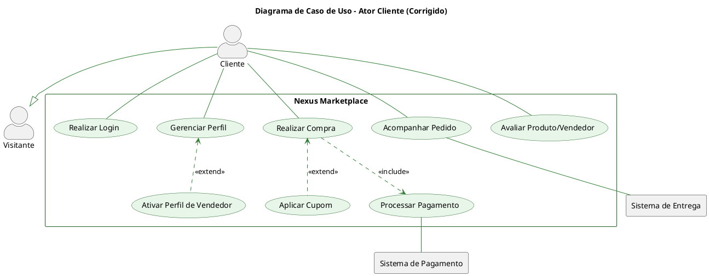

# Diagrama do Ator: Cliente

```plantuml

@startuml
' Configurações de aparência
skinparam actorStyle awesome
skinparam usecase {
    BackgroundColor #E8F5E9
    BorderColor #1B5E20
    ArrowColor #2E7D32
}
skinparam rectangle {
    BorderColor #1B5E20
}

title Diagrama de Caso de Uso - Ator Cliente (Corrigido)

' Atores
actor "Cliente" as C
actor "Visitante" as V
agent "Sistema de Pagamento" as SP
agent "Sistema de Entrega" as SE

' Herança
C --|> V

' Sistema
rectangle "Nexus Marketplace" {
    usecase "Realizar Login" as UC4
    usecase "Gerenciar Perfil" as UC5
    usecase "Realizar Compra" as UC6
    usecase "Acompanhar Pedido" as UC7
    usecase "Avaliar Produto/Vendedor" as UC8
    usecase "Ativar Perfil de Vendedor" as UC9
    usecase "Processar Pagamento" as UC_PAY
    usecase "Aplicar Cupom" as UC16
}

' Relacionamentos
C -- UC4
C -- UC5
C -- UC6
C -- UC7
C -- UC8

' Relações de Inclusão e Extensão
UC6 ..> UC_PAY : <<include>>
UC5 <.. UC9 : <<extend>>
UC6 <.. UC16 : <<extend>>

' Relacionamento com Sistemas Externos
UC_PAY -- SP
UC7 -- SE

@enduml
```
