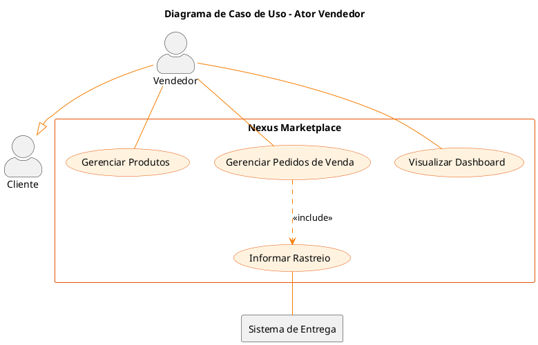

# Diagrama do Ator: Vendedor

```plantuml

@startuml
' Configurações de aparência
skinparam actorStyle awesome
skinparam usecase {
    BackgroundColor #FFF3E0
    BorderColor #E65100
    ArrowColor #F57C00
}
skinparam rectangle {
    BorderColor #E65100
}

title Diagrama de Caso de Uso - Ator Vendedor

' Atores
actor "Vendedor" as S
actor "Cliente" as C
agent "Sistema de Entrega" as SE

' Herança
S --|> C

' Sistema
rectangle "Nexus Marketplace" {
    usecase "Gerenciar Produtos" as UC10
    usecase "Gerenciar Pedidos de Venda" as UC11
    usecase "Visualizar Dashboard" as UC12
    usecase "Informar Rastreio" as UC13
}

' Relacionamentos
S -- UC10
S -- UC11
S -- UC12

' Relações de Inclusão
UC11 ..> UC13 : <<include>>

' Relacionamento com Sistema Externo
UC13 -- SE

@enduml
```
