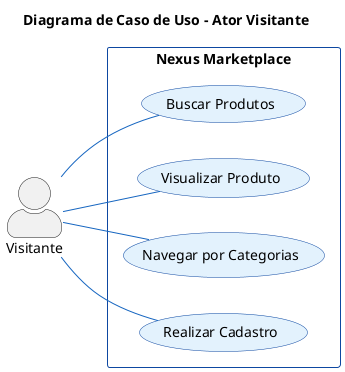

# Diagrama do Ator: Visitante

```plantuml

@startuml
' Configurações de aparência
skinparam actorStyle awesome
skinparam usecase {
    BackgroundColor #E3F2FD
    BorderColor #0D47A1
    ArrowColor #1565C0
}
skinparam rectangle {
    BorderColor #0D47A1
}
left to right direction

title Diagrama de Caso de Uso - Ator Visitante

' Ator
actor "Visitante" as V

' Sistema
rectangle "Nexus Marketplace" {
    usecase "Buscar Produtos" as UC1
    usecase "Visualizar Produto" as UC2
    usecase "Navegar por Categorias" as UC_NAV
    usecase "Realizar Cadastro" as UC3
}

' Relacionamentos
V -- UC1
V -- UC2
V -- UC_NAV
V -- UC3

@enduml
```
