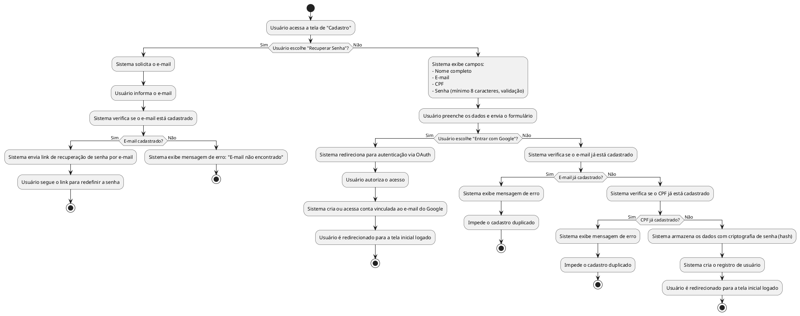
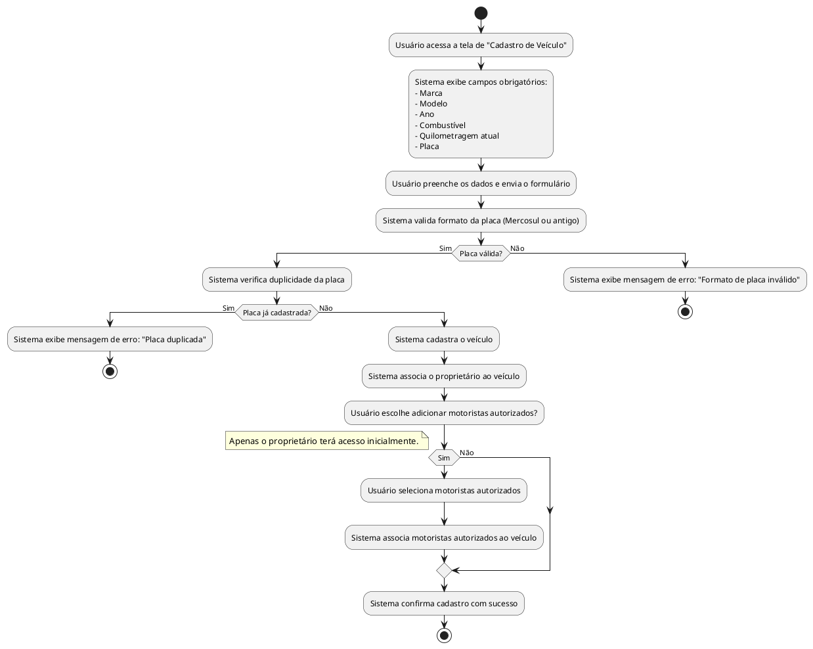
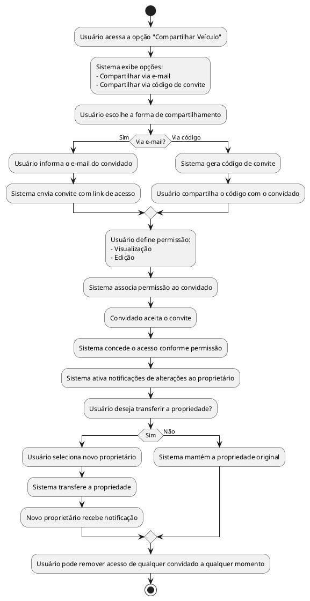
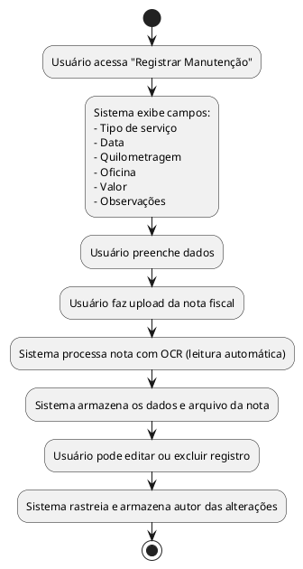
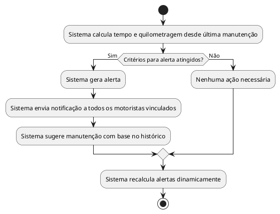
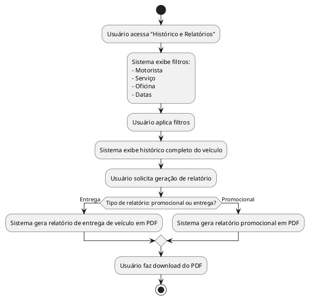
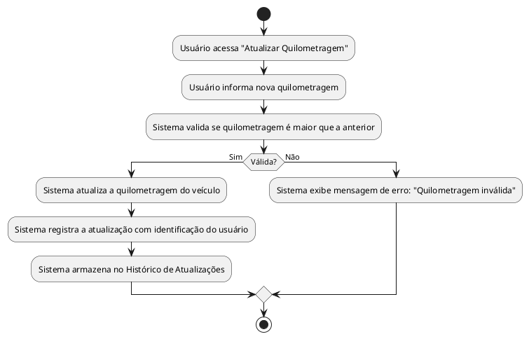
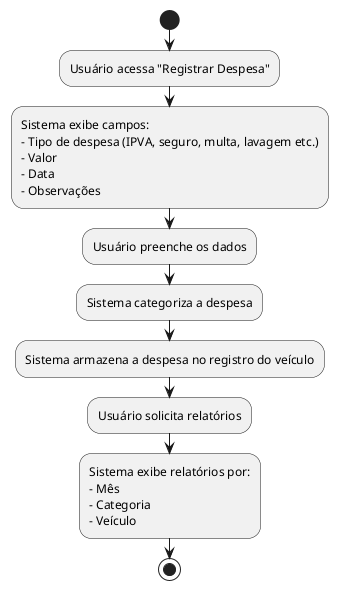
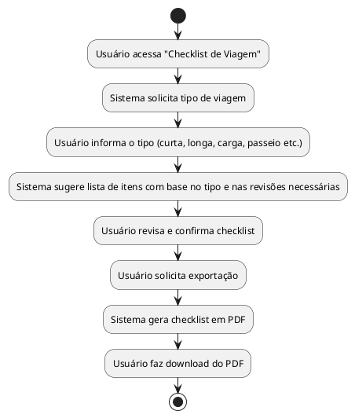

# 📃 Diagramas de Atividade

### 1. Cadastro e Autenticação
- Cadastro com nome completo, e-mail e senha.  
- Login via conta Google.  
- Recuperação de senha por e-mail.  
- Senhas armazenadas com hash seguro.  
- Edição e exclusão de conta.  

### 2. Cadastro de Veículos
- Cadastro de múltiplos veículos por usuário.  
- Campos obrigatórios: marca, modelo, ano, combustível, quilometragem atual, placa.  
- Validação de placa (formatos Mercosul e antigo).  
- Prevenção de placas duplicadas.  
- Indicação de proprietário e motoristas autorizados.  
- Edição e exclusão com controle de permissões.  

### 3. Compartilhamento de Veículos
- Compartilhamento via e-mail ou código de convite.  
- Controle de permissões (visualização ou edição).  
- Remoção de acesso a qualquer momento.  
- Notificações de alterações feitas por convidados.  
- Transferência de propriedade do veículo.

### 4. Registro de Manutenções
- Registro de tipo de serviço, data, quilometragem, oficina, valor e observações.  
- Upload de nota fiscal com leitura automática (OCR).  
- Edição e exclusão com rastreamento do autor. 

### 5. Alertas Inteligentes
- Geração de alertas por tempo e quilometragem.  
- Notificações para todos os motoristas vinculados.  
- Sugestões automáticas com base no histórico de manutenções.  
- Cálculo dinâmico de alertas.

### 6. Histórico e Relatórios
- Histórico completo por veículo.  
- Filtros por motorista, serviço, oficina e datas.  
- Relatórios promocionais e exportação em PDF.  
- Geração de relatório de entrega de veículo.

### 7. Atualização de Quilometragem
- Atualização manual da quilometragem.  
- Histórico das atualizações por usuário.  

### 8. Módulo de Despesas Gerais
- Registro de despesas como IPVA, seguro, multas, lavagens, etc.  
- Categorização das despesas.  
- Relatórios por mês, categoria e veículo.  

### 9. Checklist de Viagem
- Lista sugerida com base no tipo de viagem e revisões.  
- Exportação em PDF.

