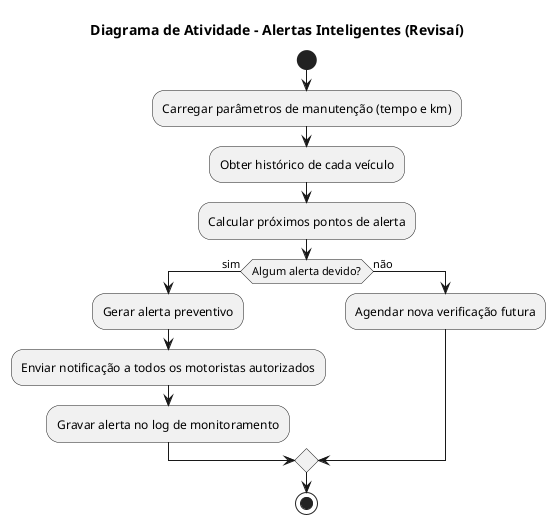

# Alertas Inteligentes

```puml
@startuml AlertasInteligentes
|Sistema|
start
title Diagrama de Atividade - Alertas Inteligentes (Revisaí)

:Carregar parâmetros de manutenção (tempo e km);
:Obter histórico de cada veículo;
:Calcular próximos pontos de alerta;
if (Algum alerta devido?) then (sim)
  :Gerar alerta preventivo;
  :Enviar notificação a todos os motoristas autorizados;
  :Gravar alerta no log de monitoramento;
else (não)
  :Agendar nova verificação futura;
endif
stop
@enduml
```
