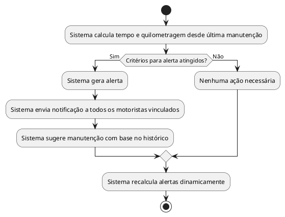

# Alertas Inteligentes

- Geração de alertas por tempo e quilometragem.  
- Notificações para todos os motoristas vinculados.  
- Sugestões automáticas com base no histórico de manutenções.  
- Cálculo dinâmico de alertas.

