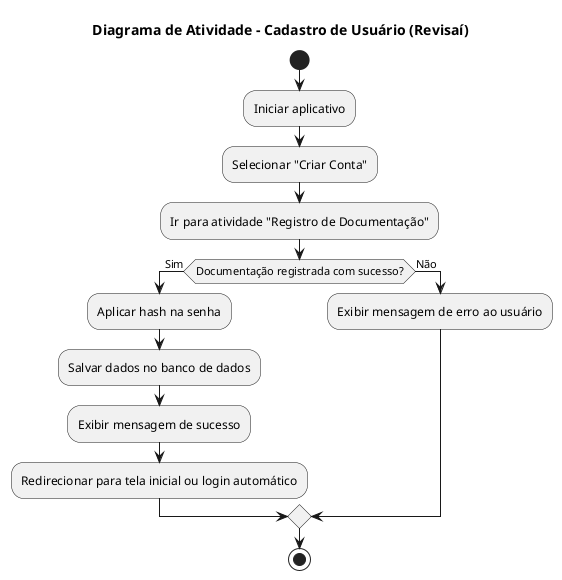

# Cadastro de Usuário

```puml
@startuml
title Diagrama de Atividade - Cadastro de Usuário (Revisaí)
start
:Iniciar aplicativo;
:Selecionar "Criar Conta";
:Ir para atividade "Registro de Documentação";
if (Documentação registrada com sucesso?) then (Sim)
:Aplicar hash na senha;
:Salvar dados no banco de dados;
:Exibir mensagem de sucesso;
:Redirecionar para tela inicial ou login automático;
else (Não)
:Exibir mensagem de erro ao usuário;
endif
stop
@enduml
```
