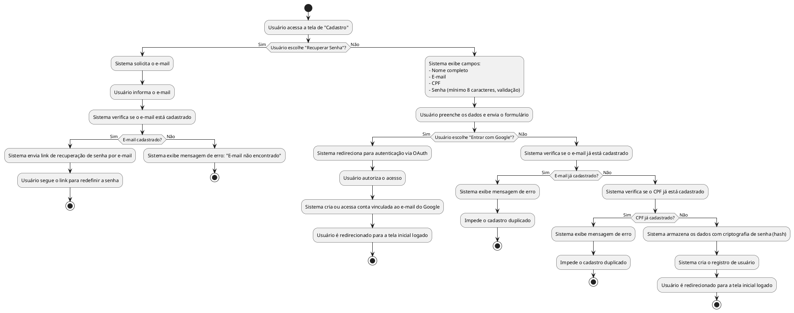

## Diagrama de Atividade: Cadastro de Usuário

- Cadastro com nome completo, e-mail e senha.  
- Login via conta Google.  
- Recuperação de senha por e-mail.  
- Senhas armazenadas com hash seguro.  
- Edição e exclusão de conta.  

