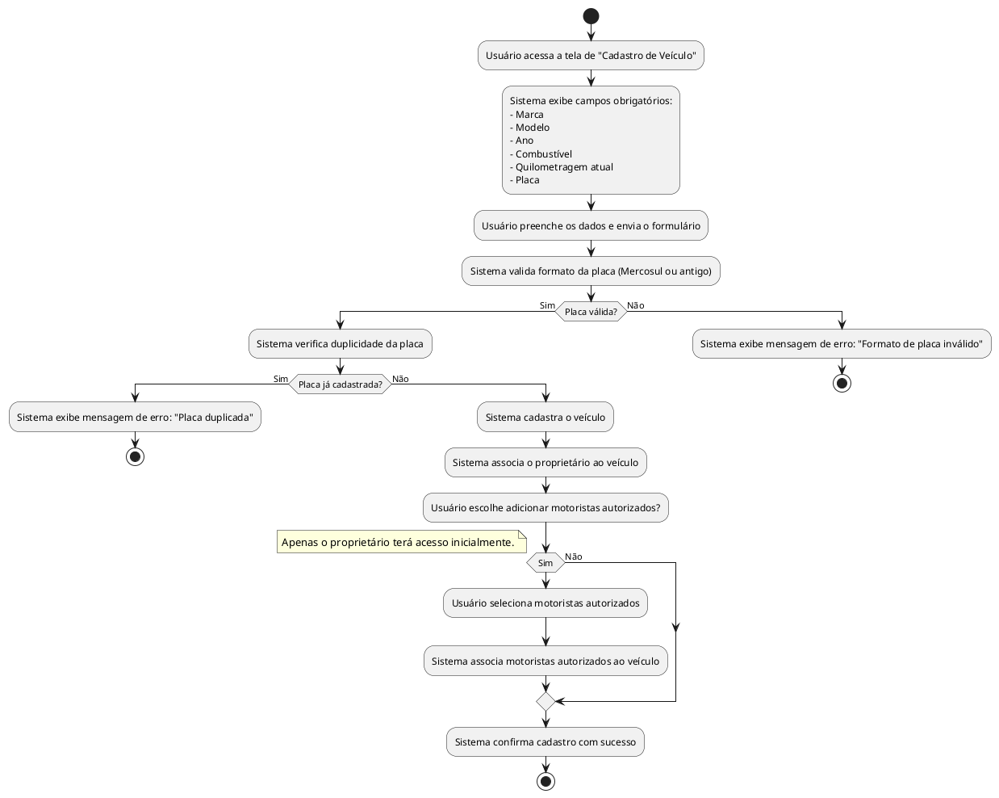

## Diagrama de Atividade: Cadastro de Veículo

- Cadastro de múltiplos veículos por usuário.  
- Campos obrigatórios: marca, modelo, ano, combustível, quilometragem atual, placa.  
- Validação de placa (formatos Mercosul e antigo).  
- Prevenção de placas duplicadas.  
- Indicação de proprietário e motoristas autorizados.  
- Edição e exclusão com controle de permissões.  

