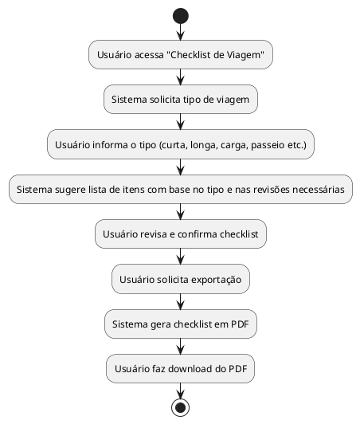

## Diagrama de Atividade: Checklist de Viagem

- Lista sugerida com base no tipo de viagem e revisões.  
- Exportação em PDF.

```puml
@startuml
start

:Usuário acessa "Checklist de Viagem";

:Sistema solicita tipo de viagem;

:Usuário informa o tipo (curta, longa, carga, passeio etc.);

:Sistema sugere lista de itens com base no tipo e nas revisões necessárias;

:Usuário revisa e confirma checklist;

:Usuário solicita exportação;

:Sistema gera checklist em PDF;

:Usuário faz download do PDF;

stop
@enduml
```

