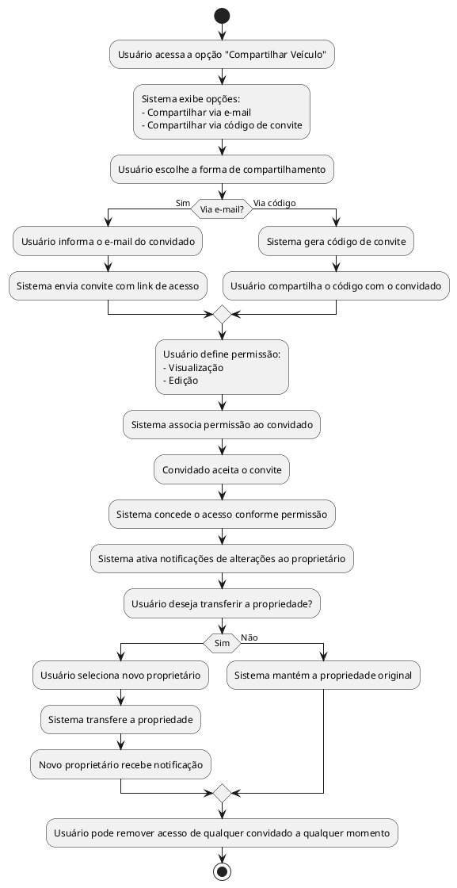

## Diagrama de Atividade: Compartilhar Veículo

- Compartilhamento via e-mail ou código de convite.  
- Controle de permissões (visualização ou edição).  
- Remoção de acesso a qualquer momento.  
- Notificações de alterações feitas por convidados.  
- Transferência de propriedade do veículo.

