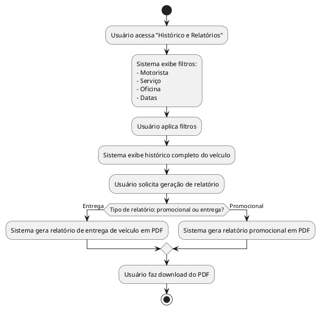

## Diagrama de Atividade: Emitir Relatório/Histórico

- Histórico completo por veículo.  
- Filtros por motorista, serviço, oficina e datas.  
- Relatórios promocionais e exportação em PDF.  
- Geração de relatório de entrega de veículo.

