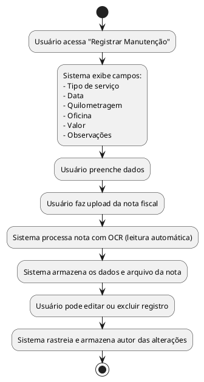

## Diagrama de Atividade: Manutenções do veículo

- Registro de tipo de serviço, data, quilometragem, oficina, valor e observações.  
- Upload de nota fiscal com leitura automática (OCR).  
- Edição e exclusão com rastreamento do autor. 

