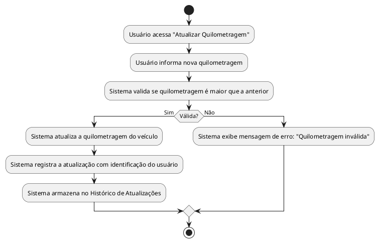

## Diagrama de Atividade: Atualizar Quilometragem

- Atualização manual da quilometragem.  
- Histórico das atualizações por usuário.  

```puml
@startuml
start

:Usuário acessa "Atualizar Quilometragem";

:Usuário informa nova quilometragem;

:Sistema valida se quilometragem é maior que a anterior;

if (Válida?) then (Sim)
  :Sistema atualiza a quilometragem do veículo;

  :Sistema registra a atualização com identificação do usuário;

  :Sistema armazena no Histórico de Atualizações;

else (Não)
  :Sistema exibe mensagem de erro: "Quilometragem inválida";
endif

stop
@enduml
```
