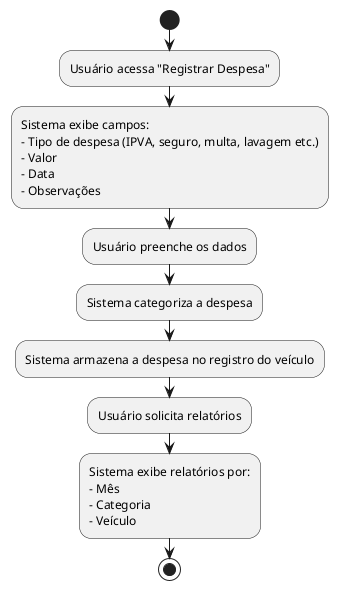

## Diagrama de Atividade: Registrar Despesas Gerais

- Registro de despesas como IPVA, seguro, multas, lavagens, etc.  
- Categorização das despesas.  
- Relatórios por mês, categoria e veículo.  

