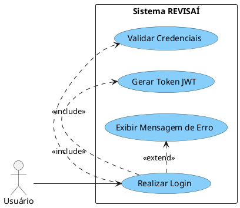
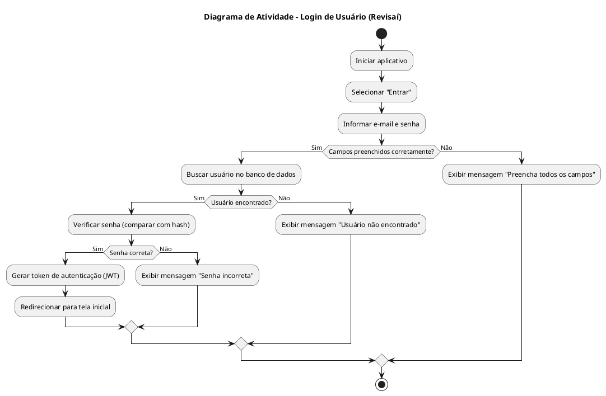

## Diagrama de Atividade

#### 1. 🎯 Caso de Uso: Login de Usuário
- [1. 🎯 Caso de Uso: Login](#1--caso-de-uso-login)
	- [1.1. Identificação](#11-identificação)
	- [1.2. Visão Geral](#12-visão-geral)
	- [1.3. Fluxo Principal](#13-fluxo-principal)
	- [1.4. Fluxo Alternativo](#14-fluxo-alternativo)
	- [1.5. Fluxos de Exceção](#15-fluxos-de-exceção)
		- [1.5.1. a. Campos Vazios](#151-a-campos-vazios)
		- [1.5.2. b. Falha ao buscar usuário](#152-b-falha-ao-buscar-usuário)
		- [1.5.3. c. Senha incorreta](#153-c-senha-incorreta)
	- [1.6. Pré-condições](#16-pré-condições)
	- [1.7. Pós-condições](#17-pós-condições)
	- [1.8. Regras de Negócio](#18-regras-de-negócio)
	- [1.9. Perfis de Usuário](#19-perfis-de-usuário)
- [2. Diagrama de Atividades](#2-diagrama-de-atividades)

## 1.1. Identificação
- **Nome**: Login  
- **Ator Primário**: Usuário  
- **Descrição**: Permite que um usuário acesse o sistema mediante a inserção e validação de suas credenciais (usuário e senha).

---

## 1.2. Visão Geral

## 1.3. Fluxo Principal
  1. Usuário informa e-mail e senha
  2. Sistema valida credenciais
  3. Sistema gera token JWT
  4. Usuário é autenticado

---

## 1.4. Fluxo Alternativo
  1. Campos não preenchidos
  2. Usuário não encontrado
  3. Senha incorreta

---

## 1.5. Fluxos de Exceção

### 1.5.1. a. Campos Vazios
- Se o usuário tentar enviar o formulário com campos em branco:
  - O sistema exibe uma mensagem: `"Preencha todos os campos."`
  - O fluxo retorna para a etapa 1.

### 1.5.2. b. Falha ao buscar usuário
- Se não foi encontrado o usuário:
  - O sistema exibe uma mensagem: `"Usuário não encontrado"`
  - O fluxo retorna para a etapa 1.

### 1.5.3. c. Senha incorreta
- Se o usuário digitou a senha errada:
  - Uma mensagem é exibida: `"Senha incorreta"`
  - O fluxo retorna para a etapa 1.

---

## 1.6. Pré-condições
- O sistema deve estar online e acessível.
- O usuário deve possuir uma conta previamente registrada.

---

## 1.7. Pós-condições
- O usuário está autenticado no sistema.
- O acesso às funcionalidades está liberado conforme o perfil do usuário.

---

## 1.8. Regras de Negócio
- Credenciais devem ser compostas por:
  - Usuário: entre 4 e 20 caracteres alfanuméricos.
  - Senha: mínimo de 8 caracteres, contendo letras e números.
- Após 5 tentativas inválidas consecutivas, o sistema bloqueia o acesso por 15 minutos.
- A autenticação define o perfil de acesso do usuário.
- Usuários inativos não podem efetuar login.

---

## 1.9. Perfis de Usuário
| Perfil            | Descrição                                                 | Acesso ao sistema     |
| ----------------- | --------------------------------------------------------- | --------------------- |
| **Proprietário**  | Usuário com acesso a todas as funcionalidades.            | Todas as funcionalidades |
| **Motorista**     | Usuário com acesso limitado.                              | Não tem acesso a função Compartilhar Veículo |

---

# 2. Diagrama de Atividades

