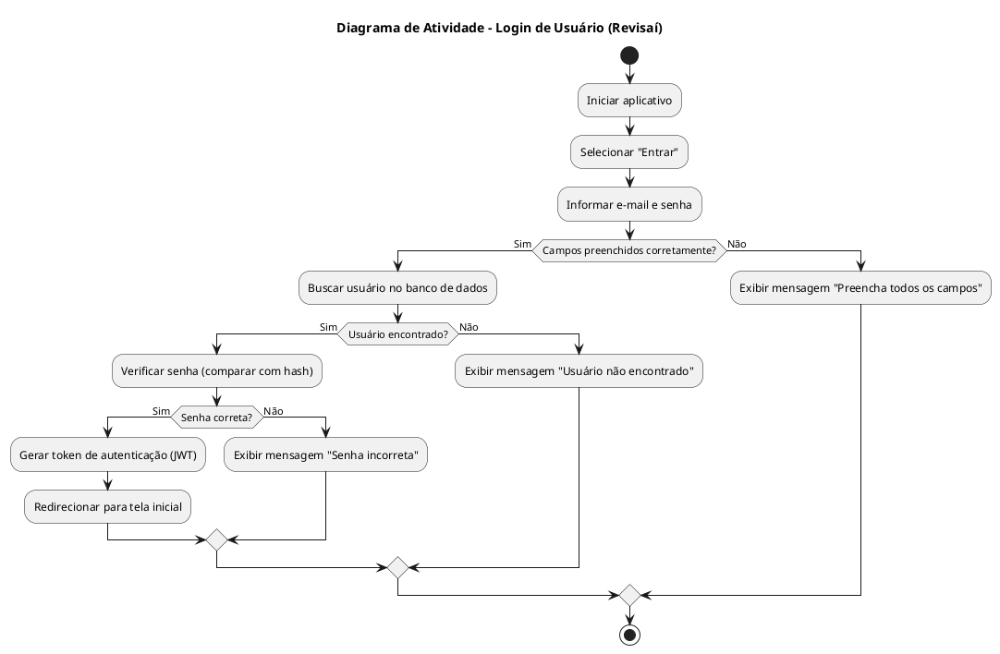

# Login de Usuário

```puml
@startuml
title Diagrama de Atividade - Login de Usuário (Revisaí)

start

:Iniciar aplicativo;
:Selecionar "Entrar";
:Informar e-mail e senha;

if (Campos preenchidos corretamente?) then (Sim)
  :Buscar usuário no banco de dados;
  if (Usuário encontrado?) then (Sim)
    :Verificar senha (comparar com hash);
    if (Senha correta?) then (Sim)
      :Gerar token de autenticação (JWT);
      :Redirecionar para tela inicial;
    else (Não)
      :Exibir mensagem "Senha incorreta";
    endif
  else (Não)
    :Exibir mensagem "Usuário não encontrado";
  endif
else (Não)
  :Exibir mensagem "Preencha todos os campos";
endif

stop
@enduml
```
