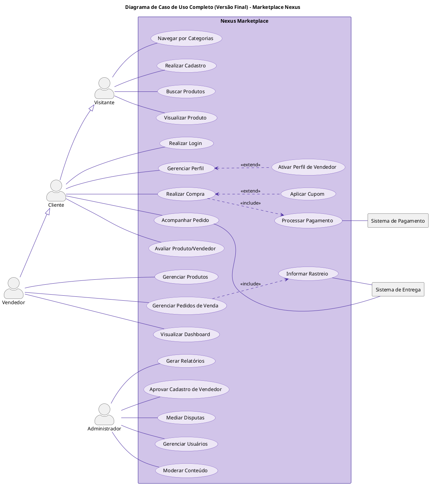
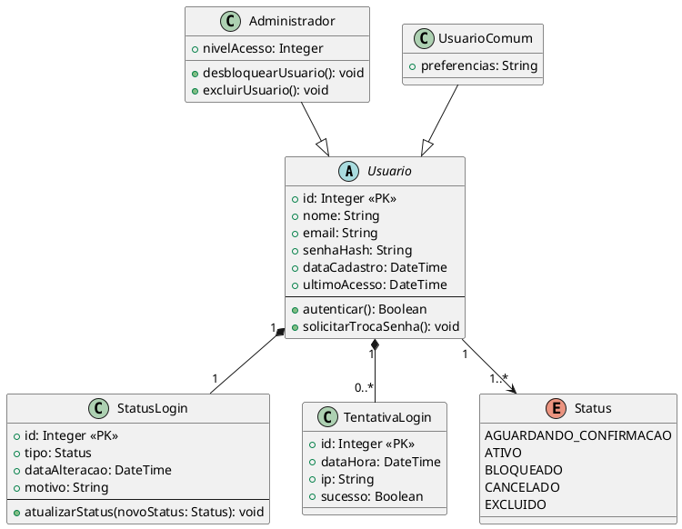

# 📊 Diagramas UML do Sistema

## Visão Geral do Sistema

> Adicionar o diagrama de caso de uso que mostra a visão geral do sistema

[Diagrama Geral](./DiagramaDeCasoDeUsoCompleto.png)

## Casos de Uso

> Para cada item, apresentar: Nome, Atores, Fluxo principal, Fluxo alternativo, Pré-condições e Pós-condições, etc.

| Nome                                                                     | Descrição breve                    |
| ------------------------------------------------------------------------ | ---------------------------------- |
| [Visitante](./DiagramasDeCasosDeUso/DiagramaDoAtor-Visitante.md)         | Visualiza e busca produtos         |
| [Cliente](./DiagramasDeCasosDeUso/DiagramaDoAtor-Cliente.md)             | Visualiza, busca e compra produtos |
| [Vendedor](./DiagramasDeCasosDeUso/DiagramaDoAtor-Vendedor.md)           | Gerencia e vende produtos          |
| [Administrador](./DiagramasDeCasosDeUso/DiagramaDoAtor-Administrador.md) | Controle total sobre a plataforma  |

| Imagens                                                                       |
| ----------------------------------------------------------------------------- |
| [Visitante](./DiagramasDeCasosDeUso/DiagramaDeCasoDeUsoVisitante.png)         |
| [Cliente](./DiagramasDeCasosDeUso/DiagramaDeCasoDeUsoCliente.png)             |
| [Vendedor](./DiagramasDeCasosDeUso/DiagramaDeCasoDeUsoVendedor.png)           |
| [Administrador](./DiagramasDeCasosDeUso/DiagramaDeCasoDeUsoAdministrador.png) |

## 🔹 Diagrama de Classes

@startuml
' Configurações de aparência
skinparam classAttributeIconSize 0
skinparam linetype ortho

' Enumerações para status e tipos
enum StatusPedido {
PENDENTE
PAGO
ENVIADO
ENTREGUE
CANCELADO
EM_DISPUTA
}

enum MetodoPagamento {
CARTAO_CREDITO
PIX
BOLETO
}

enum StatusPagamento {
PENDENTE
APROVADO
RECUSADO
}

enum StatusDisputa {
ABERTA
AGUARDANDO_MEDIACAO
RESOLVIDA
REJEITADA
}

' Classe Base e Herança de Usuários
class Usuario {

- id: int
- email: String
- senhaHash: String
- dataCadastro: Date

* login(): boolean
* logout(): void
  }

class Cliente {

- nome: String
- cpf: String

* verHistoricoPedidos(): Pedido[]
* abrirDisputa(pedido: Pedido): Disputa
  }

class Vendedor {

- nomeLoja: String
- cnpj: String
- reputacao: float

* cadastrarProduto(produto: Produto): void
* gerenciarEstoque(produto: Produto, qtde: int): void
  }

class Administrador {

- nivelAcesso: int

* mediarDisputa(disputa: Disputa, decisao: String): void
* aprovarVendedor(vendedor: Vendedor): void
  }

' Classes do Núcleo de Vendas
class Pedido {

- id: int
- data: Date
- valorTotal: double
- valorFrete: double
- status: StatusPedido

* calcularTotal(): double
  }

class ItemDePedido {

- quantidade: int
- precoUnitario: double
  }

class Produto {

- id: int
- nome: String
- descricao: String
- preco: double
- estoque: int
  }

class Categoria {

- id: int
- nome: String
  }

class Endereco {

- id: int
- logradouro: String
- cidade: String
- cep: String
  }

' Classes de Suporte e Feedback
class Avaliacao {

- nota: int
- comentario: String
- data: Date
  }

class Disputa {

- id: int
- motivo: String
- dataAbertura: Date
- status: StatusDisputa

* adicionarMensagem(msg: MensagemDisputa): void
  }

class MensagemDisputa {

- texto: String
- data: Date
  }

class Pagamento { - id: int - valor: double - status: StatusPagamento - metodo: MetodoPagamento
}

' Relacionamentos
' Herança
Usuario <|-- Cliente
Cliente <|-- Vendedor
Usuario <|-- Administrador

' Associações e Composições
Cliente "1" -- "0.._" Pedido : faz
Cliente "1" -- "1.._" Endereco : possui
Pedido "1" _-- "1.._" ItemDePedido : contém
ItemDePedido "1" -- "1" Produto : refere-se a
Vendedor "1" -- "0.._" Produto : vende
Categoria "1" -- "0.._" Produto : agrupa
Pedido "1" -- "1" Endereco : "enviado para"
Pedido "1" -- "1..\*" Pagamento : "processado via"

' Feedback e Suporte
Avaliacao "0.._" -- "1" Produto
Avaliacao "1" -- "1" Cliente : escrita por
Disputa "1" -- "1" Pedido
Disputa "1" _-- "1.._" MensagemDisputa : contém
MensagemDisputa "1" -- "1" Usuario : enviada por
Disputa "0.._" -- "0..1" Administrador : mediada por

' Notas Explicativas
note right of Vendedor
A herança **Cliente <|-- Vendedor** significa
que todo Vendedor "é um" Cliente,
podendo também realizar compras.
end note

note bottom of ItemDePedido
A composição **Pedido \*-- ItemDePedido**
significa que um ItemDePedido não
existe sem um Pedido associado.
end note

@enduml

| Imagem                                                              |
| ------------------------------------------------------------------- |
| [DiagramaDeClasses](./DiagramaDeClasses/DiagramaDeClassesNexus.png) |

### Diagrama de Classes Reajustado

| Imagem                                                                             |
| ---------------------------------------------------------------------------------- |
| [DiagramaDeClassesReajustado](./DiagramaDeClasses/DiagramaDeClassesReajustado.png) |

### Módulo de Usuário

## Diagrama de Atividades

| DiagramaDeAtividade                                                                                                 | Imagem                                                                                                                          |
| ------------------------------------------------------------------------------------------------------------------- | ------------------------------------------------------------------------------------------------------------------------------- |
| [Cadastro de Cliente](./DiagramasDeAtividades/DiagramaDeAtividade-CadastroCliente.md)                               | [Imagem de Cadastro de Cliente](./DiagramasDeAtividades/DiagramaDeAtividade-CadastroCliente.png)                                |
| [Cadastro de Vendedor](./DiagramasDeAtividades/DiagramaDeAtividade-CadastroVendedor.md)                             | [Imagem de Cadastro de Vendedor](./DiagramasDeAtividades/DiagramaDeAtividade-CadastroVendedor.png)                              |
| [Finalização de Compra](./DiagramasDeAtividades/DiagramaDeAtividade-FinalizacaoDeCompra.md)                         | [Imagem de Finalização de Compra](./DiagramasDeAtividades/DiagramaDeAtividade-FinalizacaoDeCompra.png)                          |
| [Gestão de Disputa e Devolução](./DiagramasDeAtividades/DiagramaDeAtividade-GestaoDeDisputaEDevolucao.md)           | [Imagem de Gestão de Dispulta e Devolução](./DiagramasDeAtividades/DiagramaDeAtividade-GestaoDeDisputaEDevolucao.png)           |
| [Mediação do Administrador](./DiagramasDeAtividades/DiagramaDeAtividade-MediacaoDoAdministrador.md)                 | [Imagem de Mediação do Administrador](./DiagramasDeAtividades/DiagramaDeAtividade-MediacaoDoAdministrador.png)                  |
| [Publicação e Moderação de Produtos](./DiagramasDeAtividades/DiagramaDeAtividade-PublicacaoEModeracaoDeProdutos.md) | [Imagem de Publicação e Moderação de Produtos ](./DiagramasDeAtividades/DiagramaDeAtividade-PublicacaoEModeracaoDeProdutos.png) |
| [Repasse do Vendedor](./DiagramasDeAtividades/DiagramaDeAtividade-RepasseVendedor.md)                               | [Imagem de Repasse do Vendedor](./DiagramasDeAtividades/DiagramaDeAtividade-RepasseVendedor.png)                                |

## 🔹 Diagrama de Estados

> Mostra os estados possíveis de cada entidade [ex: login] e as transições entre eles.

| Nome                                                           | Finalidade / Obs             | Imagem                                                                    |
| -------------------------------------------------------------- | ---------------------------- | ------------------------------------------------------------------------- |
| [Pedido](./DiagramasDeEstado/DiagramaDeEstado-Pedido.md)       | Ciclo de vida dos Pedidos    | [Imagem de Pedido](./DiagramasDeEstado/DiagramaDeEstado-Pedido.png)       |
| [Disputa](./DiagramasDeEstado/DiagramaDeEstado-Disputa.md)     | Ciclo de vida das Disputas   | [Imagem de Disputa](./DiagramasDeEstado/DiagramaDeEstado-Disputa.png)     |
| [Produto](./DiagramasDeEstado/DiagramaDeEstado-Produto.md)     | Ciclo de vida dos Produtos   | [Imagem de Produto](./DiagramasDeEstado/DiagramaDeEstado-Produto.png)     |
| [Pagamento](./DiagramasDeEstado/DiagramaDeEstado-Pagamento.md) | Ciclo de vida dos Pagamentos | [Imagem de Pagamento](./DiagramasDeEstado/DiagramaDeEstado-Pagamento.png) |
| [Vendedor](./DiagramasDeEstado/DiagramaDeEstado-Vendedor.md)   | Ciclo de vida dos Vendedores | [Imagem de Vendedor](./DiagramasDeEstado/DiagramaDeEstado-Vendedor.png)   |

## Diagrama de Componentes

| Nome                                                                                            | Imagem                                                                                                     |
| ----------------------------------------------------------------------------------------------- | ---------------------------------------------------------------------------------------------------------- |
| [Cadastro e Autenticação](./DiagramasDeComponentes/ComponenteDeAutenticacaoECadastro.md)        | [Imagem de Cadastro e Autenticação](./DiagramasDeComponentes/ComponenteDeAutenticacaoECadastro.png)        |
| [Avaliação de Produto](./DiagramasDeComponentes/ComponenteDeAvaliacaoDeProduto.md)              | [Imagem de Avaliação de Produto](./DiagramasDeComponentes/ComponenteDeAvaliacaoDeProduto.png)              |
| [Compras e Pagamento](./DiagramasDeComponentes/ComponenteDeComprasEPagamentos.png)              | [Imagem de Compras e Pagamento](./DiagramasDeComponentes/ComponenteDeComprasEPagamentos.png)               |
| [Disputas e Devoluções](./DiagramasDeComponentes/ComponenteDeDisputasEDevolucoes.md)            | [Imagem de Disputas e Devoluções](./DiagramasDeComponentes/ComponenteDeDisputasEDevolucoes.png)            |
| [Gestão de Produtos](./DiagramasDeComponentes/ComponenteDeGestaoDeProdutos.md)                  | [Imagem de Gestão de Produtos](./DiagramasDeComponentes/ComponenteDeGestaoDeProdutos.png)                  |
| [Processamento de Devoluções](./DiagramasDeComponentes/ComponenteDeProcessamentoDeDevolucao.md) | [Imagem de Processamento de Devoluções](./DiagramasDeComponentes/ComponenteDeProcessamentoDeDevolucao.png) |
| [Mediação de Disputas](./DiagramasDeComponentes/ComponenteMediacaoDeDisputas.md)                | [Imagem de Mediação de Disputas](./DiagramasDeComponentes/ComponenteMediacaoDeDisputas.png)                |
