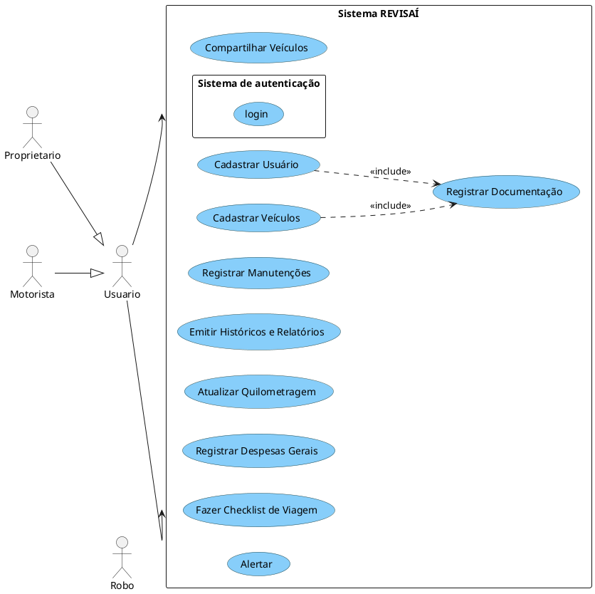

# 📊 Diagramas UML do Sistema

# Visão Geral do Sistema

# 🔹Diagrama de caso de uso

[Imagem](./diagramaUsoImagem.md) 

# 🔹Diagrama de Atividade

| Nome                               | Descrição breve             | Observações |
| ---------------------------------- | --------------------------- | ----------- |
| [Realizar Login](./UC_login.md) | Permite o acesso ao sistema | -           |
| [Cadastrar Usuário](./UC_Cadastro_Usuário.md) | Permite o cadastro de usuário | -           |
| [Cadastrar Veiculo](./UC_Cadastro_Veículo.md) | Permite o cadastro de veiculo | -           |
| [Compartilhar Veículos](./UC_Compartilhar_Veículo.md) | Permite o compartilhamento de veiculo | -           |
| [Registrar Manutenções](./UC_Manutenção.md) | Permite o registro de manutenção do veiculo | -           |
| [Emitir Históricos e Relatórios](./UC_Emitir_Relatório.md) | Permite a emição de relatórios e o histórico do veiculo | -           |
| [Atualizar Quilometragem](./UC_Quilometragem.md) | Permite a atualização manual da quilometragem do veiculo | -           |
| [Registrar Despesas Gerais](./UC_Registro_Despesas.md) | Permite o registro e emição das despesas do veiculo | -           |
| [Fazer Checklist de Viagem](./UC_Checklist.md) | Permite a criação de uma checklist com base na distância da viagem | -           |

# 🔹 Diagrama de Classes

| Nome                                     | Descrição breve                                               | Observações |
|------------------------------------------|----------------------------------------------------------------|-------------|
| [Usuario](./CL_Usuario.md)               | Representa o usuário da aplicação, com permissões e métodos de conta. | -           |
| [Veiculo](./CL_Veiculo.md)               | Representa um veículo cadastrado pelo usuário.                 | -           |
| [Manutencao](./CL_Manutencao.md)        | Armazena informações de serviços realizados no veículo.       | -           |
| [Alerta](./CL_Alerta.md)                 | Permite a criação de alertas de manutenção por tempo ou quilometragem. | -           |
| [Despesa](./CL_Despesa.md)               | Registra despesas gerais associadas ao veículo.               | -           |
| [Historico](./CL_Historico.md)           | Mantém um log de ações realizadas sobre o veículo.            | -           |
| [Compartilhamento](./CL_Compartilhamento.md) | Gerencia o compartilhamento de veículos com outros usuários.   | -           |
| [ChecklistViagem](./CL_Checklist.md)     | Permite criar listas personalizadas para preparo de viagens.   | -           |
| [Relacionamentos](./CL_Relacionamentos.md) | Define as associações entre usuários, veículos e outras entidades do sistema. | -           |

# 🔹 Diagrama de Estados

| Nome                                     | Descrição breve                                               | Observações |
|------------------------------------------|----------------------------------------------------------------|-------------|
| [Usuario](./DE_usuario.md)               | Representa os estados possíveis da conta de um usuário. | -           |
| [Veiculo](./DE_Veiculo.md)               | Mostra os estados de um veículo no sistema:cadastro, compartilhamento, transferência ou exclusão.         | -           |
| [Manutencao](./DE_Manutencao.md)         | Reflete o ciclo de vida de uma manutenção veicular      | -           |
| [Historico](./DE_H_Manutencao.md)        | Permite mostrar todo o historico de manutenção deo veiculo. | -           |
| [Alerta](./DE_AL_Manutencao.md)          | Descreve o comportamento dos alertas inteligentes do sistema, desde a geração até o encerramento. | -           |

