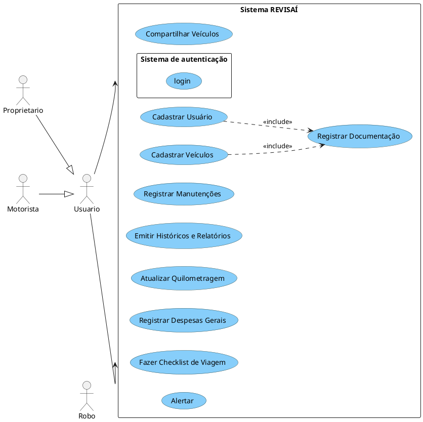
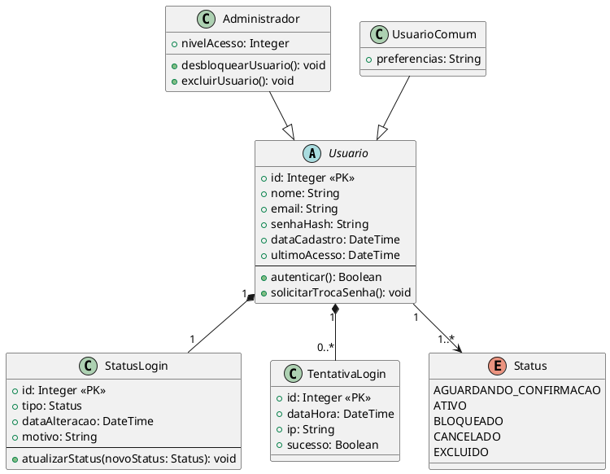

# 📊 Diagramas UML do Sistema

## Visão Geral do Sistema

> Diagrama de caso de uso

## Casos de Uso

| Nome                               | Descrição breve             | Observações |
| ---------------------------------- | --------------------------- | ----------- |
| [Realizar Login](./UC_login.md) | Permite o acesso ao sistema | -           |
| [Cadastrar Usuário](./UC_Cadastro_Usuário.md) | Permite o cadastro de usuário | -           |
| [Cadastrar Veiculo](./UC_Cadastro_Veículo.md) | Permite o cadastro de veiculo | -           |
| [Registrar Documentação]() | Registra a documentação dos cadastros | É necessario para a conclusão dos cadastros |
| [Compartilhar Veículos](./UC_Compartilhar_Veículo.md) | Permite o compartilhamento de veiculo | -           |
| [Registrar Manutenções](./UC_Manutenção.md) | Permite o registro de manutenção do veiculo | -           |
| [Emitir Históricos e Relatórios](./UC_Emitir_Relatório.md) | Permite a emição de relatórios e o histórico do veiculo | -           |
| [Atualizar Quilometragem](./UC_Quilometragem.md) | Permite a atualização manual da quilometragem do veiculo | -           |
| [Registrar Despesas Gerais](./UC_Registro_Despesas.md) | Permite o registro e emição das despesas do veiculo | -           |
| [Fazer Checklist de Viagem](./UC_Checklist.md) | Permite a criação de uma checklist com base na distância da viagem | -           |

## 🔹 Diagrama de Classes

### Módulo de Usuário

## 🔹 Diagrama de Estados

> Mostra os estados possíveis de cada entidade [ex: login] e as transições entre eles.

| Nome                            | Finalidade / Obs  |
| ------------------------------- | ----------------- |
| [Status Usuário](./DE_login.md) | Status do usuário |
| A2                              | B2                |
| A3                              | B3                |

