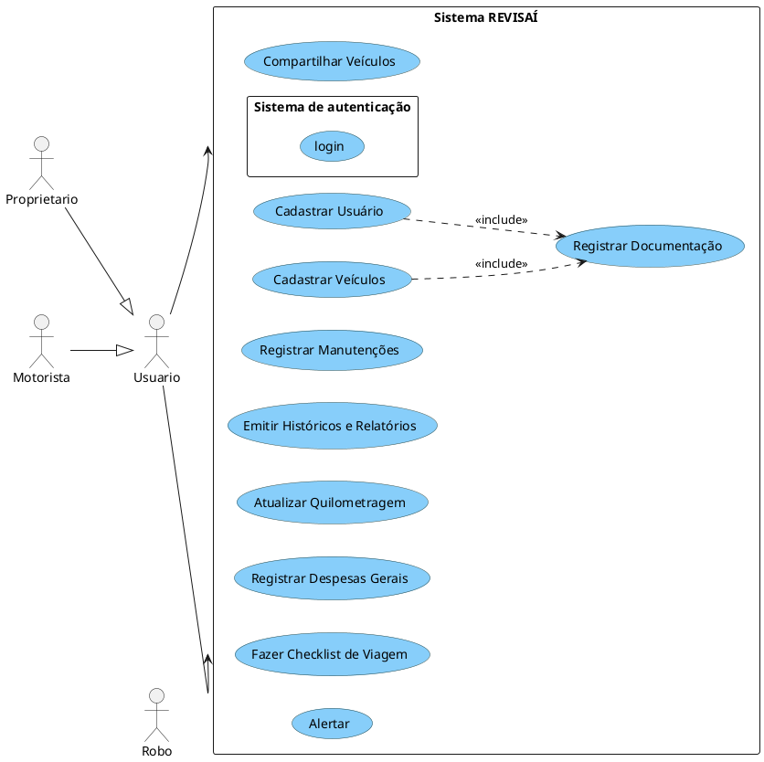
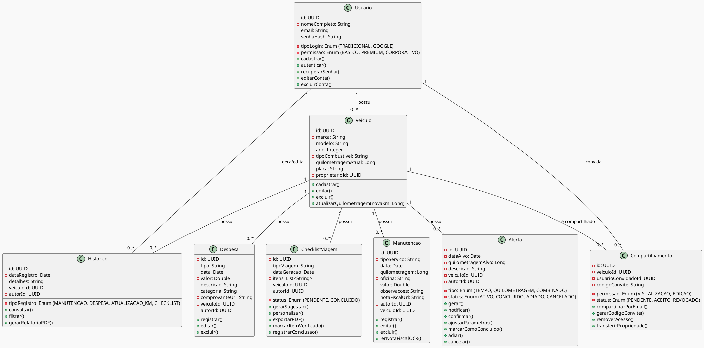

# 📊 Diagramas UML do Sistema

## Visão Geral do Sistema

> Diagrama de caso de uso

```puml
@startuml
left to right direction
skinparam packageStyle rectangle
skinparam usecase {
  BackgroundColor LightSkyBlue
  BorderColor DarkSlateGray
}

actor Usuario
actor Motorista
actor Proprietario
actor Robo

rectangle "Sistema REVISAÍ" {

 rectangle "Sistema de autenticação" {
    usecase "login" as UC1
}
  
    usecase "Cadastrar Usuário" as UC2
    usecase "Registrar Documentação" as UC3
    usecase "Cadastrar Veículos" as UC4
    usecase "Compartilhar Veículos" as UC5
    usecase "Registrar Manutenções" as UC6
    usecase "Emitir Históricos e Relatórios" as UC7
    usecase "Atualizar Quilometragem" as UC8
    usecase "Registrar Despesas Gerais" as UC9
    usecase "Fazer Checklist de Viagem" as UC10
  
  usecase "Alertar" as UC11
}

Usuario --> UC1
Usuario --> UC2
Usuario --> UC4
Usuario --> UC6
Usuario --> UC7
Usuario --> UC8
Usuario --> UC9
Usuario --> UC10
Proprietario --> UC5

Motorista --|> Usuario
Proprietario --|> Usuario
Robo --> UC11

UC2 ..> UC3 : <<include>>
UC4 ..> UC3 : <<include>>

@enduml
```

## Casos de Uso

| Nome                               | Descrição breve             | Observações |
| ---------------------------------- | --------------------------- | ----------- |
| [Realizar Login](./UC_login.md) | Permite o acesso ao sistema | -           |
| [Cadastrar Usuário](./UC_Cadastro_Usuário.md) | Permite o cadastro de usuário | -           |
| [Cadastrar Veiculo](./UC_Cadastro_Veículo.md) | Permite o cadastro de veiculo | -           |
| [Registrar Documentação] | Registra a documentação dos cadastros | É necessario para a conclusão dos cadastros |
| [Compartilhar Veículos](./UC_Compartilhar_Veículo.md) | Permite o compartilhamento de veiculo | -           |
| [Registrar Manutenções](./UC_Manutenção.md) | Permite o registro de manutenção do veiculo | -           |
| [Emitir Históricos e Relatórios](./UC_Emitir_Relatório.md) | Permite a emição de relatórios e o histórico do veiculo | -           |
| [Atualizar Quilometragem](./UC_Quilometragem.md) | Permite a atualização manual da quilometragem do veiculo | -           |
| [Registrar Despesas Gerais](./UC_Registro_Despesas.md) | Permite o registro e emição das despesas do veiculo | -           |
| [Fazer Checklist de Viagem](./UC_Checklist.md) | Permite a criação de uma checklist com base na distância da viagem | -           |

## 🔹 Diagrama de Classes

### Módulo de Usuário

```plantuml
@startuml
!theme mars

class Usuario {
    -id: UUID
    -nomeCompleto: String
    -email: String
    -senhaHash: String
    -tipoLogin: Enum (TRADICIONAL, GOOGLE)
    -permissao: Enum (BASICO, PREMIUM, CORPORATIVO)
    +cadastrar()
    +autenticar()
    +recuperarSenha()
    +editarConta()
    +excluirConta()
}

class Veiculo {
    -id: UUID
    -marca: String
    -modelo: String
    -ano: Integer
    -tipoCombustivel: String
    -quilometragemAtual: Long
    -placa: String
    -proprietarioId: UUID
    +cadastrar()
    +editar()
    +excluir()
    +atualizarQuilometragem(novaKm: Long)
}

class Manutencao {
    -id: UUID
    -tipoServico: String
    -data: Date
    -quilometragem: Long
    -oficina: String
    -valor: Double
    -observacoes: String
    -notaFiscalUrl: String
    -autorId: UUID
    -veiculoId: UUID
    +registrar()
    +editar()
    +excluir()
    +lerNotaFiscalOCR()
}

class Alerta {
    -id: UUID
    -tipo: Enum (TEMPO, QUILOMETRAGEM, COMBINADO)
    -dataAlvo: Date
    -quilometragemAlvo: Long
    -descricao: String
    -status: Enum (ATIVO, CONCLUIDO, ADIADO, CANCELADO)
    -veiculoId: UUID
    -autorId: UUID
    +gerar()
    +notificar()
    +confirmar()
    +ajustarParametros()
    +marcarComoConcluido()
    +adiar()
    +cancelar()
}

class Despesa {
    -id: UUID
    -tipo: String
    -data: Date
    -valor: Double
    -descricao: String
    -categoria: String
    -comprovanteUrl: String
    -veiculoId: UUID
    -autorId: UUID
    +registrar()
    +editar()
    +excluir()
}

class Historico {
    -id: UUID
    -dataRegistro: Date
    -tipoRegistro: Enum (MANUTENCAO, DESPESA, ATUALIZACAO_KM, CHECKLIST)
    -detalhes: String
    -veiculoId: UUID
    -autorId: UUID
    +consultar()
    +filtrar()
    +gerarRelatorioPDF()
}

class Compartilhamento {
    -id: UUID
    -veiculoId: UUID
    -usuarioConvidadoId: UUID
    -permissao: Enum (VISUALIZACAO, EDICAO)
    -codigoConvite: String
    -status: Enum (PENDENTE, ACEITO, REVOGADO)
    +compartilharPorEmail()
    +gerarCodigoConvite()
    +removerAcesso()
    +transferirPropriedade()
}

class ChecklistViagem {
    -id: UUID
    -tipoViagem: String
    -dataGeracao: Date
    -itens: List<String>
    -status: Enum (PENDENTE, CONCLUIDO)
    -veiculoId: UUID
    -autorId: UUID
    +gerarSugestao()
    +personalizar()
    +exportarPDF()
    +marcarItemVerificado()
    +registrarConclusao()
}

Usuario "1" -- "0..*" Veiculo : possui
Veiculo "1" -- "0..*" Manutencao : possui
Veiculo "1" -- "0..*" Alerta : possui
Veiculo "1" -- "0..*" Despesa : possui
Veiculo "1" -- "0..*" Historico : possui
Veiculo "1" -- "0..*" ChecklistViagem : possui
Usuario "1" -- "0..*" Compartilhamento : convida
Veiculo "1" -- "0..*" Compartilhamento : é compartilhado
Usuario "1" -- "0..*" Historico : gera/edita

@enduml

```

## 🔹 Diagrama de Estados

> Mostra os estados possíveis de cada entidade [ex: login] e as transições entre eles.

| Nome                            | Finalidade / Obs  |
| ------------------------------- | ----------------- |
| [Status Usuário](./DE_login.md) | Status do usuário |
| A2                              | B2                |
| A3                              | B3                |

